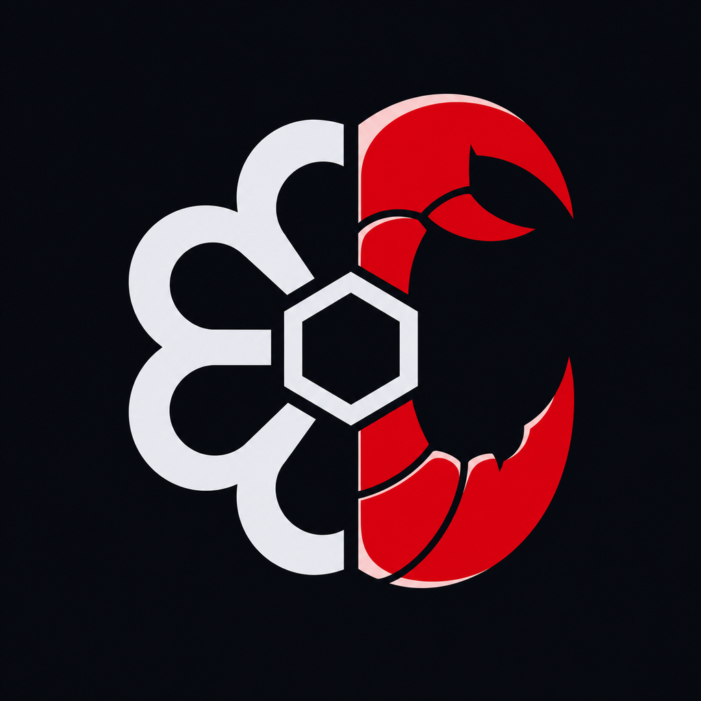

[English](README.md) | [한국어](README.ko.md) | **中文**

<p align="center">
  
</p>

<h1 align="center">codexclaw</h1>

<p align="center">
  面向 <strong>OpenAI Codex</strong> 的开发规范与多模型子代理，<br>
  以单个插件的形式提供。
</p>

<p align="center">
  <a href="https://github.com/lidge-jun/codexclaw/actions/workflows/ci.yml"></a>
  
  
  
  <a href="https://lidge-jun.github.io/codexclaw/"></a>
  <a href="LICENSE"></a>
</p>

---

codexclaw 将 Codex 运行时转变为规范化的开发环境。它不提供独立的代理框架，而是直接在 `codex` 上叠加 skills、hooks 和 components，为基础运行时补充结构化工作流、编码规范和多模型编排能力。

## 功能

**Dev Skill Family** — 由规范父级 `dev` 统一管理的 12 个特定领域路由器（`dev-architecture`、`dev-backend`、`dev-frontend`、`dev-testing`、`dev-security`、`dev-debugging`、`dev-data`、`dev-devops`、`dev-code-reviewer`、`dev-scaffolding`、`dev-diagram-viewer`、`dev-uiux-design`）。所有路由器都继承父级的规则分类、验证门和安全规则。共包含 155 个唯一规则 ID。

**PABCD Workflow** — Plan / Audit / Build / Check / Done，基于文件驱动的 FSM 实现，并通过证明材料控制阶段转换。各阶段通过 `cxc orchestrate` 命令推进，每次转换都携带结构化证据。持久化 goalplan 账本可跨多个周期跟踪工作阶段、成功标准和已收集的证据。

```
IDLE ── P ── A ── B ── C ── D ── IDLE
       │    │    │
      gate  gate gate
       └────┴────┴──── I (Interview, context preserved)
```

**Multi-Model Subagents** — 基于角色的调度机制（explorer / reviewer / executor），支持按角色覆盖模型和提示词。配置会跨会话持久保存，并通过 spawn-wrapper hook 自动应用。本地 GUI（Vite + React）提供可视化配置；检测到 opencodex 时，还会显示 provider 快捷链接栏。（仪表盘目前需从仓库检出构建，后续版本将随插件打包。）

**Recall** — 在向用户提问前，先从磁盘产物中搜索历史 Codex 对话和 memory store，使上下文在跨会话及压缩后仍可恢复。

**Repo Map** — `cxc map <dir>` 结合 tree-sitter 解析与 PageRank 排名，为陌生代码库生成结构概览，帮助代理在深入使用 `rg` 前快速建立整体认知。

**Skill Search** — `cxc skill search <query>` 可从 cli-jaw-skills（主要来源）、ClawHub 和 Hermes 目录中发现未加载的 skills。使用 `cxc skill show <id>` 可按需加载。

## 安装

```bash
codex plugin marketplace add https://github.com/lidge-jun/codexclaw
codex plugin add codexclaw@codexclaw

# 更新
codex plugin marketplace upgrade codexclaw

# 卸载
codex plugin remove codexclaw@codexclaw
```

升级后 Codex 会将 hooks 标记为 **Modified**，需要重新批准才能激活（内容哈希信任模型）。`cxc` CLI 随仓库检出提供（`bin/codexclaw.mjs`）；marketplace 安装无需它即可激活 skills、hooks 和 MCP。

## 架构

```
plugins/codexclaw/
│
├── skills/                      27 skills
│   ├── dev/                     canonical parent — work classifier, routing, verification gate
│   ├── dev-*/                   12 surface routers (architecture → uiux-design)
│   ├── pabcd/                   PABCD workflow phases + attestation
│   ├── loop/                    durable goalplan + Stop-continuation contract
│   ├── interview/               IPABCD requirements discovery
│   ├── search/                  web search + evidence routing ladder
│   ├── recall/                  past-session + memory store search
│   └── repo-map/                tree-sitter + PageRank structure map
│
├── hooks/                       18 active hooks across the session lifecycle
│   ├── session-start-*          provider bridge, PABCD bootstrap, map affordance, recall context
│   ├── user-prompt-submit-*     PABCD trigger detection, recall intent
│   ├── pre-tool-use-*           skill attach, goal guards, patch lint, interview guard
│   ├── post-tool-use-*          interview capture, render observation
│   ├── stop-*                   PABCD continuation under active goals
│   ├── subagent-stop-*          evidence verification for worker dispatches
│   └── post-compact-*           cursor reinject, recall context, bg-terminal affordance
│
├── components/                  8 isolated feature modules (src + dist)
│   ├── pabcd-state/             FSM engine, session files, orchestrate CLI, attest gates
│   ├── subagent-config/         per-role model/prompt store + MCP surface
│   ├── recall/                  disk-artifact search across sessions + memory
│   ├── skill-search/            remote catalog query (jaw / clawhub / hermes)
│   ├── provider-bridge/         read-only opencodex detection
│   ├── messenger-bridge/        Telegram/Discord adapter (cxc serve)
│   ├── config-guard/            plugin enable/disable/status
│   └── cxc-ops/                 doctor + reset utilities
│
└── gui/                         local dashboard (Vite + React, build from source)
```

_`cxc` CLI（`bin/codexclaw.mjs` + `cli/` 工作区）位于仓库根目录，在插件 payload 之外。_

## Dev Skill Family

每个编码任务都会先划分为 C0-C5，再确定流程深度。父级 `dev` skill 会根据变更领域，将任务路由到对应的特定领域路由器：

| Surface | Router | Also loads |
|---------|--------|------------|
| Backend / API | `dev-backend` | `dev-security` for auth |
| Frontend / UI | `dev-frontend` | `dev-uiux-design` for direction |
| Database / data | `dev-data` | `dev-backend` for migrations |
| Tests / QA | `dev-testing` | `dev-frontend` for browser QA |
| Security | `dev-security` | surface-specific router |
| Architecture | `dev-architecture` | `dev-scaffolding` for structure |
| Debugging | `dev-debugging` | surface-specific router |
| DevOps / infra | `dev-devops` | `dev-security` for credentials |
| Scaffolding | `dev-scaffolding` | `dev-architecture` for boundaries |
| Code review | `dev-code-reviewer` | `dev-security` + `dev-testing` |
| Diagrams | `dev-diagram-viewer` | — |

每个路由器都有独立的模块化参考资料，仅在需要时加载，不会预加载；同时继承父级的验证门、规则分类和安全规则。

## CLI

```bash
cxc orchestrate P|A|B|C|D|status|reset   # PABCD phase control
cxc loop init|show|validate               # durable goalplan management
cxc map <dir>                             # tree-sitter structure map
cxc skill search <query>                  # remote skill discovery
cxc skill show <id>                       # load a discovered skill
cxc help                                  # command reference
```

## 生态系统

codexclaw 是参考实现。其方法论和 skills 已移植到以下项目中；这些版本与代理无关，也不依赖插件：

| Repo | Role |
|------|------|
| [pabcd_initiative](https://github.com/lidge-jun/pabcd_initiative) | Methodology spec + docs-site + agent-neutral skill set |
| [cli-jaw](https://github.com/lidge-jun/cli-jaw) | Boss/employee agent harness with skills_ref submodule |
| [ima2-gen](https://github.com/lidge-jun/ima2-gen) | Image generation tool with ima2-front/ima2-uiux skills |

## 文档

插件文档：**[lidge-jun.github.io/codexclaw](https://lidge-jun.github.io/codexclaw/)**

方法论与研究来源见 **[lidge-jun.github.io/pabcd_initiative](https://lidge-jun.github.io/pabcd_initiative/)**，涵盖 skill 架构、委派经济性、循环契约、devlog 记录，以及由 arXiv 论文支持的主张账本。

## 许可证

[MIT](LICENSE)

第三方组件：RepoMapper（MIT，Pete Davis）和 Aider tree-sitter queries（Apache-2.0）。详见 [`NOTICE.md`](plugins/codexclaw/skills/repo-map/scripts/NOTICE.md)。
