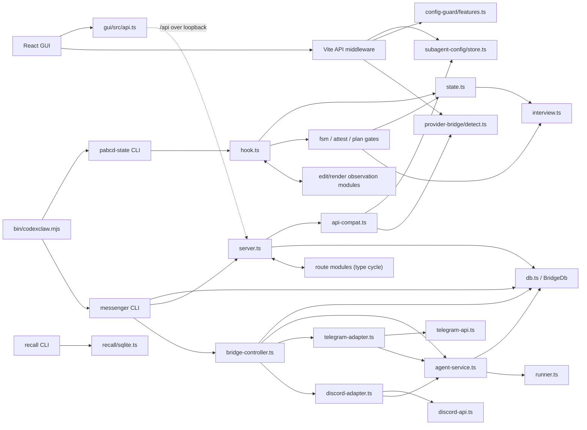

# codexclaw Architectural Analysis

Date: 2026-07-15

## Executive summary

codexclaw is a plugin monorepo with two distinct runtime planes:

1. `bin/codexclaw.mjs` is a thin command dispatcher into independently compiled
   components.
2. The `messenger-bridge` component is the stateful server plane: SQLite state,
   Codex child-process execution, Telegram/Discord adapters, and the local HTTP
   API that can host the GUI.

The PABCD state component is the other architectural center. Its `state.ts` and
`interview.ts` files define the durable session model and readiness gate consumed
by hooks, the FSM, CLI transitions, and plan/freeze paths.

The strongest positive property is component isolation at the package/runtime
level: the main CLI delegates to component `dist/cli.js` entrypoints, and the
components mostly use relative imports plus Node built-ins. The main structural
risks are five import cycles, a 978-line persistence god module, duplicated GUI
API implementations/contracts, and duplicated transport-client plumbing.

## Method and ranking caveat

I ran the requested command:

```text
cxc map .
```

It completed and emitted a symbol map. However, every displayed file had
`Rank value: 1.0000`. This is explained by the current implementation: when no
`--chat-files` personalization is supplied, `repomap_class.py` explicitly assigns
uniform ranks (`plugins/codexclaw/skills/repo-map/scripts/repomap_class.py:346-354`).
Therefore the command's default output is a useful symbol listing, but not a
repo-wide importance ordering.

For the requested top-ten ranking, I built a second, auditable graph over the
runtime source scope: `components/*/src`, `gui/src`, and `bin`, excluding
`dist`, tests, and generated/build directories. The graph has 126 files and 314
resolved relative-import edges. PageRank uses alpha 0.85 and uniform teleport;
in/out degree is reported as the connectivity cross-check. This avoids treating
test fixtures, documentation, helper scripts, and same-named symbols as core
runtime dependencies.

## Top 10 files by PageRank/connectivity

| Rank | File | PageRank | In | Out | Architectural interpretation |
|---:|---|---:|---:|---:|---|
| 1 | `plugins/codexclaw/components/pabcd-state/src/interview.ts` | 0.07716307 | 8 | 0 | Shared interview schema and readiness leaf; many state-machine consumers depend on it. |
| 2 | `plugins/codexclaw/components/pabcd-state/src/state.ts` | 0.05835688 | 17 | 1 | Durable session/FSM state substrate; the highest-connectivity runtime module. |
| 3 | `plugins/codexclaw/gui/src/ui/icons.tsx` | 0.02916778 | 9 | 0 | Shared GUI icon registry; high score is fan-in, not domain centrality. |
| 4 | `plugins/codexclaw/components/messenger-bridge/src/discord-api.ts` | 0.02267805 | 11 | 0 | Discord REST contract/client and shared output chunking helpers. |
| 5 | `plugins/codexclaw/gui/src/api.ts` | 0.02103538 | 10 | 0 | Browser-side API facade and the GUI's duplicated wire contracts. |
| 6 | `plugins/codexclaw/components/messenger-bridge/src/db.ts` | 0.02061098 | 16 | 0 | Bridge SQLite schema, migrations, and all persistence operations. |
| 7 | `plugins/codexclaw/components/messenger-bridge/src/telegram-api.ts` | 0.01975737 | 11 | 0 | Telegram REST client, update/message types, media, topic, and rich-message helpers. |
| 8 | `plugins/codexclaw/components/recall/src/sqlite.ts` | 0.01943234 | 4 | 0 | Lazy Node SQLite boundary shared by recall indexing/search modules. |
| 9 | `plugins/codexclaw/components/config-guard/src/features.ts` | 0.01873400 | 5 | 0 | Canonical declared Codex feature names and injected runner contract. |
| 10 | `plugins/codexclaw/components/subagent-config/src/store.ts` | 0.01671737 | 5 | 0 | Per-project role configuration, normalization, atomic persistence, and spawn resolution. |

The high-ranked zero-outdegree files are shared contracts/leaves. That is
expected in a PageRank graph: a file referenced by many modules can outrank a
controller even when it contains little orchestration logic.

## Detailed file analysis

### 1. `pabcd-state/src/interview.ts`

Role: canonical interview tracker schema and readiness logic. It defines the four
dimensions (`goal`, `constraint`, `success`, `ontology`), levels, contradiction
severity, bounded tracker records, and optional ontology entities
(`interview.ts:20-90`).

Key exports:

- `reconstructOntologySchema` (`:92`)
- `defaultInterview` and `reconstructInterview` (`:164-175`)
- `isInterviewReady` and `evaluateInterviewGate` (`:253-309`)
- `normalizeInterview` (`:309`)

Connections: `state.ts` imports the reconstruct/normalize/readiness functions
(`state.ts:4`); the FSM and freeze/transition paths consume readiness; hooks,
triage, minds, and rescan coordination consume the tracker types and dimensions.
This is a strong domain leaf: it owns the interview concept and is mostly free of
filesystem/process concerns.

Architectural note: the fail-closed reconstruction and explicit bounded arrays are
good boundary discipline. The main risk is that `InterviewTracker` is shared by
many workflow modules, so adding fields or changing readiness semantics has a
large behavioral blast radius.

### 2. `pabcd-state/src/state.ts`

Role: durable per-session state and append-only ledgers. It owns phase constants,
the `State`/`LedgerEntry` contracts, session-key sanitization, atomic state
materialization, state reconstruction, write normalization, transition ledger
append, and interview scan-event persistence (`state.ts:6-63`, `:115-271`).

Key exports: `Phase`, `WORK_PHASES`, `ALL_PHASES`, `PHASES`, `State`,
`defaultState`, `ensureState`, `readState`, `writeState`, `appendLedger`,
`appendInterviewEvent`, and `readInterviewEvents` (`state.ts:6-271`).

Connections: it depends on `interview.ts` for the readiness source of truth and
is imported by nearly every PABCD hook, FSM, CLI, goalplan, metrics, transcript,
and ledger module. `bin/codexclaw.mjs` reaches it indirectly through the compiled
PABCD CLI (`bin/codexclaw.mjs:333-361`).

Architectural note: the module is cohesive around durable state, but it is also a
coupling hub. It contains both session JSON and interview scan-ledger concerns;
those could eventually become separate persistence modules if the state surface
continues to grow.

### 3. `gui/src/ui/icons.tsx`

Role: zero-dependency inline SVG icon registry. `IconName` is the public icon
vocabulary and `Icon` renders either stroke icons or Telegram/Discord brand paths
(`icons.tsx:11-18`, `:89-117`).

Key exports: `IconName` and `Icon` (`icons.tsx:11`, `:89`).

Connections: imported by the GUI kit, toast, help, app shell, and page components.
It has no domain or backend dependency, which is why it is a high-fan-in leaf.

Architectural note: this is healthy locality for a visual primitive. Its PageRank
should not be interpreted as evidence that the icon layer is a business-critical
core module.

### 4. `messenger-bridge/src/discord-api.ts`

Role: minimal dependency-free Discord REST adapter. It owns request/response
contracts, Discord limits, token-bearing authorization, JSON and multipart calls,
retry-on-429 behavior, message/file operations, path redaction, and message/embed
chunking (`discord-api.ts:9-40`, `:42-123`, `:251-289`).

Key exports: `FetchImpl`, API/limit constants, `DiscordApiResult`, `DiscordEmbed`,
`DiscordFile`, `DiscordApi`, `redactDiscordPath`, `chunkDiscordMessage`, and
`chunkEmbedDescription`.

Connections: `discord-adapter.ts`, `discord-components.ts`, `discord-commands.ts`,
`gateway-commands.ts`, heartbeat, approval formatting, output formatting, and
bridge-controller all depend on this contract/client.

Architectural note: the injectable fetch seam is good for offline tests and keeps
the transport boundary explicit. The REST client duplicates retry, timeout/error,
multipart, and token-redaction patterns found in `telegram-api.ts`; a shared
transport utility would reduce policy drift.

### 5. `gui/src/api.ts`

Role: browser-side HTTP facade and GUI wire-contract registry. It defines role,
catalog, provider, bridge, agent, metrics, event, and job types; supplies safe
defaults; and exposes the `api` object for read/write calls (`api.ts:10-55`,
`:177-286`, `:314-372`).

Key exports: `RoleConfig`, `SubagentsConfig`, `MultiAgentSurface`, bridge/agent
row types, `MetricsSnapshot`, `BridgeEvent`, `setSubagentRole`,
`setMultiAgentSurface`, and `api`.

Connections: all GUI pages/components consume this module. Its fetch calls connect
over HTTP to either the Vite middleware or the loopback `messenger-bridge` server;
that connection is runtime rather than a static import (`api.ts:72-102`,
`:314-372`).

Architectural note: read failures intentionally degrade to defaults, which keeps a
static GUI bootable but can make backend outages look like empty state. More
importantly, this file duplicates backend contracts from `db.ts`, `store.ts`, and
route handlers, creating drift risk.

### 6. `messenger-bridge/src/db.ts`

Role: the bridge persistence substrate. It defines channel, allowlist, binding,
agent, job, and patch types, opens `node:sqlite`, applies schema versions 1-9,
and implements all CRUD/transaction operations (`db.ts:18-113`, `:174-419`,
`:962-978`).

Key exports: `ChannelKind`, `ChannelRow`, `AllowRow`, `BindingRow`, `AgentRow`,
`AgentPatch`, `JobRow`, `JobPatch`, `AGENT_EFFORTS`, `AGENT_THREAD_MODES`,
`BridgeDb`, and `openBridgeDb`.

Connections: server routes, bridge controller, agent service, Telegram/Discord
adapters, command modules, heartbeat, and CLI all depend on it. It is the primary
shared state boundary for the messenger component.

Architectural concern: at 978 lines it exceeds the repo architecture rule's
400-line split threshold by more than 2x. Migrations, schema ownership, channels,
bindings, agents, pairing codes, jobs, and security-sensitive file opening all
live in one class. This is a persistence god module and a high-blast-radius change
surface. A future split should retain one migration owner and extract cohesive
repositories behind narrow interfaces.

### 7. `messenger-bridge/src/telegram-api.ts`

Role: typed Telegram Bot API client over global `fetch`, including polling,
messages, topics, callbacks, webhooks, rich media, downloads, and multipart
uploads (`telegram-api.ts:9-59`, `:61-358`).

Key exports: Telegram response/update/message/file types, `TelegramApi`,
`telegramTopicId`, `telegramReplyThreadId`, `InputRichMessage`, and the injected
`FetchImpl` seam.

Connections: Telegram adapter, webhook, interactive/command modules, media and
rich-send modules, token validation, heartbeat, agent routes, and controller use
it. It is the transport counterpart to `discord-api.ts`.

Architectural note: the API boundary is clear and testable, but the client has the
same duplicated cross-cutting mechanics as Discord: token-in-URL construction,
429 retry, multipart construction, timeout handling, and error redaction.

### 8. `recall/src/sqlite.ts`

Role: lazy Node SQLite capability boundary. It uses `createRequire` so importing
recall does not immediately fail on runtimes without `node:sqlite`, and exposes
small `Stmt`/`RwDb` structural contracts plus read-only/read-write openers
(`sqlite.ts:9-37`).

Key exports: `Stmt`, `RwDb`, `openDbReadOnly`, and `openDbReadWrite`.

Connections: recall ingest, index-db, index-search, and threads-db depend on this
module. It is deliberately narrow and is a good example of a deep seam: the
recall subsystem can be tested against the small structural DB interface.

### 9. `config-guard/src/features.ts`

Role: feature-flag policy and injected Codex CLI runner contract. It owns the
declared feature allowlist, the soft-feature set, parsing of `codex features list`,
effective-state reconstruction, and the list of flags still needing activation
(`features.ts:6-30`, `:36-71`).

Key exports: `DECLARED_FEATURES`, `DeclaredFeature`, `SOFT_FEATURES`,
`CodexRunResult`, `CodexRunner`, `parseFeaturesList`, `readDeclaredState`, and
`featuresToEnable`.

Connections: config-guard activation/deactivation/CLI and multi-agent-v2 import
the policy. GUI development middleware also reaches the config-guard source to
resolve Codex home and invoke feature operations.

Architectural note: dependency injection and exact first-field parsing are strong
choices. The main boundary concern is that GUI middleware directly imports this
component's source path, coupling a Vite development package to plugin internals.

### 10. `subagent-config/src/store.ts`

Role: project-local `.codexclaw/subagents.json` store. It owns role names/modes,
effort policy, strict reconstruction, validation, atomic writes, patch application,
and spawn-time resolution (`store.ts:13-48`, `:50-172`).

Key exports: `ROLES`, `RoleName`, `RoleMode`, `EFFORTS`, `RoleConfig`,
`SubagentsConfig`, `defaultRole`, `defaultConfig`, `readConfig`,
`validateRolePatch`, `writeConfig`, `setRole`, `SpawnResolution`, and
`resolveSpawnConfig`.

Connections: subagent CLI/MCP/spawn wrapper/hook use it; GUI server handlers and
`messenger-bridge/api-compat.ts` use it to serve role configuration. The GUI
duplicates its types and effort constants rather than importing a shared contract
(`api.ts:15-26`, `:238-239`).

## Core dependency graph



The GUI-to-server arrows are HTTP contracts, not TypeScript imports. The GUI
development middleware imports component source directly; the built static GUI is
served by `messenger-bridge`, whose compatibility routes instead import compiled
component dists (`api-compat.ts:15-20`).

## Architectural concerns and code smells

### 1. Five production import cycles

The runtime relative-import graph contains five strongly connected components:

- `recall/src/chat-search.ts` ↔ `index-search.ts` (`chat-search.ts:26`,
  `index-search.ts:14`)
- `messenger-bridge/src/agent-service.ts`, `approval-relay.ts`,
  `gateway-commands.ts`, `telegram-commands.ts`, and `telegram-interactive.ts`
  (`agent-service.ts:20`, `approval-relay.ts:1-2`, `telegram-commands.ts:8-24`)
- `discord-commands.ts` ↔ `discord-interactions.ts`
  (`discord-commands.ts:4`, `discord-interactions.ts:13`)
- `server.ts`, `api-compat.ts`, `connect-routes.ts`, and `agent-routes.ts`
  (`server.ts:15-17`, `api-compat.ts:20`, `connect-routes.ts:12`,
  `agent-routes.ts:11`)
- `pabcd-state/src/hook.ts`, `edit-shape.ts`, and `render-observations.ts`
  (`hook.ts:31`, `edit-shape.ts:25`, `render-observations.ts:23-24`)

Several edges are type-only, but they still indicate boundary leakage and can
become runtime cycles when a type import gains a value import. The route cycle is
the easiest first target: extract `ApiCtx`, `ApiResponse`, and `ApiRoute` into a
small contracts module that route implementations can import without importing
the server assembly module.

### 2. Persistence god module

`messenger-bridge/src/db.ts` is 978 lines and owns schema evolution plus five
logical repositories. It is the dominant shared mutable boundary and makes any
schema or row-contract change expensive to review. Split by responsibility behind
one migration/bootstrap owner: schema/migrations, channel/allowlist repository,
agent/pairing repository, binding repository, and job repository.

### 3. GUI API implementation drift

The Vite dev path and static `cxc serve` path intentionally duplicate route
semantics (`api-compat.ts:4-13`). They have already diverged: the GUI dev handler
passes `effort` through (`gui/src/server/handlers.ts:45-49`), while the production
compatibility route omits it (`api-compat.ts:72-75`). A role-effort save can work in
the Vite development server and silently fail to persist through the static bridge
server. One shared handler/route contract should serve both adapters.

### 4. Duplicated wire contracts and constants

The GUI defines its own `RoleConfig`, `SubagentsConfig`, effort lists, agent rows,
binding rows, and event shapes (`gui/src/api.ts:15-26`, `:193-286`) while backend
types live in `subagent-config/src/store.ts` and `messenger-bridge/src/db.ts`.
This is understandable for browser bundling, but the current duplicated literals
are a drift vector. Generate or share a dependency-free contracts package, or add
contract tests that compare the two route surfaces and enum sets.

### 5. Transport policy duplication

`telegram-api.ts` and `discord-api.ts` independently implement authenticated HTTP,
429 retry, multipart handling, token-safe errors, and injectable fetch seams
(`telegram-api.ts:70-140`, `discord-api.ts:51-123`). A small transport utility can
centralize retry/backoff/error-redaction while leaving provider-specific payloads
and limits in each client.

### 6. GUI development package crosses component boundaries

`gui/src/server/handlers.ts` and `middleware.ts` import component source via
`../../../components/...`, while the build contract describes components as
independently compiled units. This makes the Vite dev server a second integration
path with different source/dist behavior. Move shared server handlers into a
runtime component or expose a documented package API rather than reaching through
source paths.

### 7. Static map ranking is not global by default

The repo-map implementation's no-chat-files branch hardcodes all ranks to 1.0
(`repomap_class.py:346-354`). That is a tooling architecture smell because the
CLI description promises a ranked repository map while the default invocation
cannot produce a meaningful global PageRank. Either run a true global PageRank
when no personalization is supplied or label the current output as a symbol map.

### 8. Read-side fallback can hide service failures

The GUI API intentionally returns empty/default data on failed reads
(`gui/src/api.ts:92-103`). This makes static/no-backend operation robust, but it
also conflates “empty system” with “backend unavailable.” Preserve the fallback
for boot, but expose an explicit degraded/error state to the UI and telemetry.

### 9. Sensitive tokens share the main SQLite substrate

`BridgeDb` stores bot tokens in the project-local database and relies on mode
hardening (`db.ts:177-185`, `:962-978`). This is a reasonable local MVP boundary,
but token storage, WAL/SHM sidecars, backups, and migration copies should remain an
explicit security ownership area as the bridge grows.

## Bottom line

The codebase has clear high-level seams: CLI dispatch, PABCD state, bridge server,
transport adapters, recall, config guard, and subagent configuration. The first
architectural hardening pass should be:

1. break the five cycles, starting with extracted route contracts;
2. split `BridgeDb` without changing its public behavior;
3. unify the GUI dev/static route implementation and shared wire contracts;
4. factor common transport policy; and
5. fix or explicitly relabel the default repo-map ranking behavior.

No existing worktree changes were modified by this analysis; this report is the
only new artifact.
