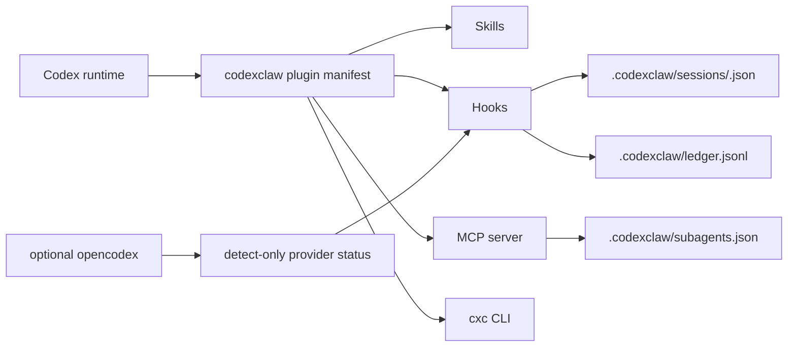

# L11 / 110 - Developer Docs + Website Design Plan

Status: DONE (research/design + source-of-truth reconciliation) - 2026-06-30 - 10-agent sweep requested by user

> Scope: decide whether codexclaw can ship developer documentation plus a public docs
> website, using sibling references `../cli-jaw`, `../opencodex`, the current
> codexclaw repo, and the `cxc-dev-*` skills; then reconcile stale source-of-truth
> wording discovered before website implementation. No docs-site scaffold is shipped in this pass.

## Verdict

Yes: codexclaw should have a developer-docs website.

Recommended shape:
- Use an Astro/Starlight-style docs site patterned after `../opencodex/docs-site`.
- Keep the README short and product-facing; put detailed maintainer truth in docs and
  `structure/`.
- Position codexclaw as a **Codex plugin layer**, not a jawcode/cli-jaw harness and not
  an opencodex provider proxy.
- Publish docs with explicit `current`, `planned`, and `deferred` badges so the site does
  not overclaim L9, L12+, L20, or future hardening work. L4-L8 and L10 are current
  source-of-truth records, not future promises.

## Dispatch Summary

10 read-only subagents were used. None edited files.

| Agent axis | Primary question | Main output |
|---|---|---|
| codexclaw source map | What is the current source of truth? | `structure/INDEX.md`, `mvp_res/000_INDEX.md`, `mvp_hard/000_INDEX.md`, plugin manifest, hooks, state, skills, CLI. |
| cli-jaw docs model | Which cli-jaw docs patterns transfer? | Quickstart, architecture SOT, PABCD concepts, command tables, dashboard guides transfer as IA patterns only. |
| opencodex docs/site | Which opencodex docs/site patterns transfer? | Starlight IA, manual sidebar, concise README, structure docs, mature console visual language. |
| jawcode UX reference | What should not be copied from jawcode? | jawcode is an explicit harness with slash commands, receipts, and `.jwc/goal`; codexclaw must document hook/skill/file-state equivalents. |
| skills/catalog | How should `$cxc-*` skills be explained? | `cxc-dev` is implicit; the rest are on-demand. Explain shorthand, namespaced plugin mentions, and file-path fallback. |
| developer API | What API/reference pages are needed? | CLI, hooks, state schema, MCP tools, subagent config, provider bridge, GUI endpoints. |
| install/release | What install docs are missing? | Marketplace install, local dogfood symlink, activation, hook trust, build/dist, future npm/npx packaging. |
| visual direction | What should the site feel like? | Dense developer-control surface: quiet, precise, table/diagram heavy, no marketing spectacle. |
| IA synthesis | What pages should exist? | 20-page docs IA from overview to troubleshooting, ordered by first-run user journey. |
| verification | What gates prove the docs/site? | Build/test, docs build, link check, stale-doc tests, Playwright screenshots, a11y checks. |

## Skill Guidance Applied

`cxc-dev` classifies this as C3: cross-domain docs/design planning with future frontend,
developer-reference, and release impacts.

Relevant dev-skill routing:
- `cxc-dev-frontend`: public site and docs UI require domain-correct density, concrete
  assets, responsive behavior, accessibility, and visual verification.
- `cxc-dev-uiux-design`: the visual direction must be chosen before implementation.
- `cxc-dev-scaffolding`: reuse the repo's existing numbered devlog and `structure/`
  source-of-truth conventions; do not invent a new docs structure silently.
- `cxc-dev-testing`: docs/site completion needs mechanical gates, not visual inspection
  by assertion.

Reference constraints pulled into the plan:
- Developer console density maps to D8; docs/reference pages map to D4-D5; only the
  splash/overview page may use D2 landing density.
- Documentation needs screenshots or diagrams when they clarify tasks; abstract blobs,
  gradient meshes, and fake dashboards do not count as assets.
- Substantial UI work needs rendered verification at desktop, split-screen/tablet,
  mobile, and narrow viewports, plus keyboard/focus and asset checks.

## Current Ground Truth To Preserve

### Product boundary

codexclaw is a single Codex plugin:
- skills for development discipline and workflows;
- hooks for context injection, goal guards, PABCD state, and provider detection;
- MCP tools for subagent config;
- a small `cxc` / `codexclaw` CLI;
- optional opencodex (`ocx`) detection only.

It is not:
- a cli-jaw server;
- a jawcode runtime harness;
- an opencodex provider proxy;
- a codex-rs slash-command fork.

### Current command reality

Live root commands:
- `enable`
- `disable` / `uninstall`
- `status`
- `doctor`
- `reset`
- `chat-search`
- `gui`

Live control surfaces:
- `cxc orchestrate` terminal control
- chat `orchestrate status`, `orchestrate reset`, and `orchestrate D`
- IPABCD footer/status affordance
- Stop continuation under an active native goal plus an in-flight PABCD cycle
- `$cxc-goalplan` / `$cxc-loop` skill contracts

Placeholder or planned areas:
- `subagents` CLI
- `provider` CLI
- deeper L9 spawn-wrapper/operator surface work
- L12+ Interview runtime ledger/capture/guard work
- L20 install/deploy/npx packaging work

Docs must distinguish shipped control surfaces from remaining placeholder/runtime-deferred
areas.

### Current skill reality

Docs must explain four names for the same skill surface:
- directory shorthand: `dev-testing`, `search`, `ast-grep`;
- skill name: `$cxc-dev-testing`, `$cxc-search`, `$cxc-ast-grep`;
- plugin-native mention form where Codex exposes it: `$codexclaw:cxc-dev-testing`;
- fallback source path: `plugins/codexclaw/skills/<dir>/SKILL.md`.

Only `cxc-dev` is implicit/default. Other skills are on-demand and should not be
described as auto-loaded by a runtime hub.

### Current state reality

State docs must use:
- `.codexclaw/sessions/<sessionId>.json`
- `.codexclaw/ledger.jsonl`
- `.codexclaw/subagents.json`

Avoid stale `.codexclaw/state.json` language.

## Website Information Architecture

Recommended docs-site tree:

```text
docs-site/
  src/content/docs/
    index.mdx
    getting-started/
      installation.md
      first-run.md
      quickstart.md
    concepts/
      how-it-works.md
      plugin-boundary.md
      work-classes.md
      state-model.md
    guides/
      skills.md
      pabcd.md
      subagents.md
      opencodex-bridge.md
      gui.md
    reference/
      commands.md
      hooks.md
      api-mcp.md
      plugin-manifest.md
    development/
      dogfood-dev-symlink.md
      build-test.md
      parity-roadmap.md
    troubleshooting.md
```

Sidebar order should follow the user journey:
1. Install.
2. First run.
3. Understand the plugin boundary.
4. Use `cxc-dev`, PABCD, and subagents.
5. Inspect commands, hooks, state, MCP, and plugin manifest.
6. Dogfood and release.
7. Troubleshoot drift.

## Page Requirements

### Overview

First viewport:
- H1: `codexclaw`
- Supporting copy: "Codex-native development discipline, PABCD workflow, subagent
  config, and optional opencodex bridge."
- Visual asset: real codexclaw GUI screenshot, terminal transcript, or architecture
  diagram. No abstract gradient hero.
- Badges: `Codex plugin`, `skills`, `hooks`, `file state`, `MCP`, `ocx detect-only`.

### Installation

Must split three tracks:
- Marketplace/personal plugin install.
- Local dogfood with `scripts/dev-symlink.sh`.
- Activation with `node bin/codexclaw.mjs enable` from a source checkout, or `cxc enable`
  when installed/symlinked locally. npm/npx distribution remains future.

Must include hook-trust caveats:
- first start after install/upgrade requires Codex hook review;
- symlink dogfood means approved hooks execute mutable local checkout files;
- codexclaw must not forge hook trust or hand-edit Codex trust state.

### How Codexclaw Works

Use a diagram:



### PABCD Workflow

Must separate:
- natural-language trigger;
- strict `$cxc-orchestrate` / `orchestrate <phase>` chat command;
- live agent-gated `cxc orchestrate` CLI;
- human chat free-pass vs agent/CLI attest-gated path;
- `D` as a closing action, not a resting badge.

Must state that Stop continuation is shipped under an active native goal plus an
in-flight PABCD cycle, bounded by re-entry, IDLE/no-goal, context-pressure, and
stagnation guards.

### Skills

Must include:
- implicit vs on-demand loading;
- C0-C5 work classifier;
- companion skill routing table;
- skill hub as catalog only, not runtime loader;
- `cxc-search` scope vs `chat-search` scope;
- `cxc-ast-grep` as structural-search helper, with `rg` first for ordinary text search.

### Optional OpenCodex Bridge

Must not copy opencodex provider docs into codexclaw.

Say:
- codexclaw detects `ocx` status when present;
- native model fallback remains valid;
- provider setup, auth, account pools, sidecars, and `/v1/responses` proxy behavior
  belong to opencodex docs;
- codexclaw never runs `ocx ensure` as an unannounced mutation.

### Developer Reference

Reference pages must be generated or mechanically checked against source where possible:
- CLI switch cases from `bin/codexclaw.mjs`;
- hook manifests from `plugins/codexclaw/hooks/*.json`;
- state schema from `pabcd-state/src/state.ts`;
- legal transitions from `pabcd-state/src/fsm.ts`;
- attestation from `pabcd-state/src/attest.ts`;
- MCP tool list from `subagent-config/src/mcp.ts`;
- provider bridge from `provider-bridge/src/detect.ts`;
- skill catalog from `skills/*/SKILL.md` and `agents/openai.yaml`.

## Visual Direction

Design read:

```yaml
---
name: codexclaw-docs
colors:
  primary: "#2563eb"
  accent: "#22c55e"
  background: "#0b0f14"
typography:
  heading: { fontFamily: "system-ui", fontSize: "32-48px on splash, 20-28px in docs" }
  body: { fontFamily: "system-ui", fontSize: "14-16px" }
---
```

Reading this as a developer-control docs site for Codex plugin users, with a precise
console/reference language. It should feel closer to GitHub/Linear/OpenCodex dashboard
than a SaaS launch page.

Dial setting:
- DESIGN_VARIANCE: 3
- MOTION_INTENSITY: 1
- Product density profile: D2 for splash, D4-D5 for docs, D8 for GUI/control examples.

Visual rules:
- neutral dark/light tokens, one blue primary accent, one green success/status accent;
- 6-8px radii, not pill-heavy;
- code/path/model/state IDs in monospace;
- tables and diagrams over card grids;
- no emoji as icons;
- no giant centered generic hero for reference pages;
- no purple gradient/orb/bokeh decoration;
- no fake metrics or fake dashboards;
- use real screenshots, terminal transcripts, source diagrams, and state snippets.

## Assets To Produce

Required before public launch:
- logo/favicons: simple codexclaw mark, SVG plus PNG sizes;
- OG image: 1200x630 with product name and architecture motif;
- architecture diagram: Codex runtime -> plugin -> skills/hooks/MCP/CLI -> `.codexclaw`;
- GUI screenshots: Subagents, Prompts, and provider link bar states;
- terminal transcript screenshots or rendered blocks for `cxc doctor`, `cxc status`,
  `cxc gui`, and live `cxc orchestrate`;
- PABCD phase diagram with current/planned command surfaces;
- skills catalog table generated from source metadata or checked by test.

Do not reuse opencodex assets directly. Use opencodex only as a sibling pattern.

## Implementation Plan

Split L11 into small passes:

| Pass | Scope | Output |
|---|---|---|
| L11.1 | Docs-site scaffold decision | Choose Astro/Starlight or defer; add package/workspace only after explicit implementation loop. |
| L11.2 | Source-of-truth cleanup | Fix stale README/PABCD/MCP comments that would make public docs lie. |
| L11.3 | Core docs content | Overview, install, first-run, how-it-works, plugin-boundary, state model. |
| L11.4 | Reference docs | commands, hooks, MCP, plugin manifest, skills catalog. |
| L11.5 | Website visual system | tokens, layout, navigation, screenshots/assets, responsive behavior. |
| L11.6 | Verification gates | docs build, link check, stale-doc tests, Playwright screenshots, a11y. |

## Verification Gates For Future Implementation

Blocking checks:
- root `npm test`;
- root `npm run build`;
- docs build (`npm run docs:build` or equivalent);
- link check over markdown and built HTML;
- stale-doc checks for command list, hook list, skill list, and state paths;
- Playwright screenshots at 1440, 1024, 768, 390, and 320 px;
- keyboard/focus pass;
- no horizontal overflow;
- no clipped Korean/English labels;
- asset provenance recorded for generated or external images.

Suggested stale-doc tests:
- parse `bin/codexclaw.mjs` command cases and compare to `reference/commands.md`;
- parse plugin manifest hook paths and compare to `reference/hooks.md`;
- parse `skills/*/agents/openai.yaml` implicit flags and compare to `guides/skills.md`;
- assert public docs never mention `.codexclaw/state.json`;
- assert provider bridge docs do not claim unannounced `ocx ensure`.

## Stale Docs Queue

Resolved in this L11 reconciliation pass:
- `README.md` provider bridge wording now says detect-only / graceful native path.
- `bin/codexclaw.mjs` header now lists live `doctor`, `reset`, `chat-search`, and
  `orchestrate` delegations and keeps `subagents` / `provider` as placeholders.
- `plugins/codexclaw/hooks/session-start-ensuring-provider-bridge.json` status text now
  says detecting, not ensuring.
- `plugins/codexclaw/components/subagent-config/src/mcp.ts` header now matches the
  advertised `subagents_get`, `subagents_set`, and `catalog_list` tools.
- `plugins/codexclaw/components/provider-bridge/package.json` now describes detect-only
  status probing.
- `structure/INDEX.md`, `plugins/codexclaw/skills/README.md`, and skill-hub metadata now
  describe on-demand skills without calling them hidden.

Still valid for future docs implementation:
- `cxc status` / `cxc reset` docs need namespacing: current commands are config/ops,
  while `cxc orchestrate status/reset` are PABCD phase-control commands.

## Non-Goals

- No codex-rs slash-command fork.
- No jaw server, employee/boss model, or jawcode harness clone.
- No unannounced opencodex provider setup or `ocx ensure`.
- No public docs that claim planned features are shipped.
- No marketing-only site without working developer references.

## Evidence Anchors

- codexclaw README boundary: `README.md`
- architecture hub: `structure/INDEX.md`
- shipped MVP ledger: `devlog/_plan/mvp_res/000_INDEX.md`
- hardening ledger: `devlog/_plan/mvp_hard/000_INDEX.md`
- plugin manifest: `plugins/codexclaw/.codex-plugin/plugin.json`
- CLI switch: `bin/codexclaw.mjs`
- PABCD state: `plugins/codexclaw/components/pabcd-state/src/state.ts`
- PABCD FSM: `plugins/codexclaw/components/pabcd-state/src/fsm.ts`
- chat grammar: `plugins/codexclaw/components/pabcd-state/src/orchestrate-grammar.ts`
- chat apply: `plugins/codexclaw/components/pabcd-state/src/orchestrate-apply.ts`
- MCP tools: `plugins/codexclaw/components/subagent-config/src/mcp.ts`
- provider detection: `plugins/codexclaw/components/provider-bridge/src/detect.ts`
- skill catalog: `plugins/codexclaw/skills/skill-hub/references/catalog.md`
- opencodex docs-site pattern: `../opencodex/docs-site/astro.config.mjs`
- cli-jaw developer docs pattern: `../cli-jaw/docs/dev/`
- jawcode harness contrast: `../jawcode/README.md`
