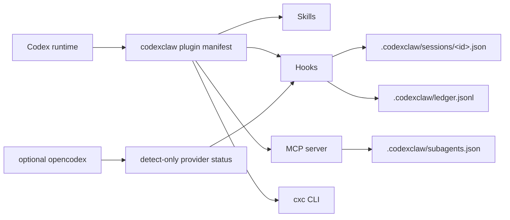

codexclaw is one plugin manifest that registers four kinds of surface with the Codex runtime,
all backed by a small file state under `.codexclaw/`.

## Skills

Skills carry the development discipline. `cxc-dev` is the implicit, always-on classifier; the
rest (`dev-frontend`, `dev-testing`, `pabcd`, `loop`, `interview`, `ast-grep`, ...) load on
demand. The skill hub is a catalog, not a runtime loader. See the
[Skills guide](/codexclaw/guides/skills/).

## Hooks

Thirteen hooks connect Codex lifecycle events to codexclaw state, covering session start,
orchestration, pre/post-tool guards, subagent evidence, and compaction recovery:

| Event | Hooks | Role |
|---|---|---|
| `SessionStart` (×2) | provider-bridge, project-rules | Detect `ocx` status; surface project rules. |
| `UserPromptSubmit` | pabcd-trigger | Parse orchestrate grammar and inject phase directives. |
| `Stop` | pabcd-continuation | Keep an in-flight cycle advancing under an active goal. |
| `PreToolUse` (×5) | goal-budget, interview-in-goal, skill-attach, friction-advise, edit-lint | Guard goals, deny interview in goal mode, attach skills to spawns, check friction, lint edits. |
| `PostToolUse` (×2) | interview-capture, friction-record | Capture interview answers; record shell friction. |
| `SubagentStop` | evidence-verify | Verify subagent evidence bundles. |
| `PostCompact` | reinject-cursor | Recover PABCD state after context compaction. |

Full matchers and timeouts are in the [Hooks reference](/codexclaw/reference/hooks/).

## MCP server

The subagent-config MCP server exposes `subagents_get`, `subagents_set`, and `catalog_list`. It
reads and writes role → model/prompt config in `.codexclaw/subagents.json`. See the
[MCP Tools reference](/codexclaw/reference/api-mcp/).

## CLI

The `cxc` / `codexclaw` binary is a thin delegator over the compiled component CLIs:
`enable` / `disable` / `status` route to config-guard, `doctor` / `reset` to cxc-ops,
`orchestrate` / `freeze` / `metric` / `divergence` / `goalplan` to pabcd-state, `subagents`
to subagent-config, `provider` to provider-bridge, and `gui` to the Vite dashboard. See
the [Commands reference](/codexclaw/reference/commands/).

## File state

All durable state lives under the project `.codexclaw/` directory — session JSON, the append-only
transition ledger, the interview scan-evidence ledger, and subagent config. There is no separate
server or database. See the [State Model](/codexclaw/concepts/state-model/).
