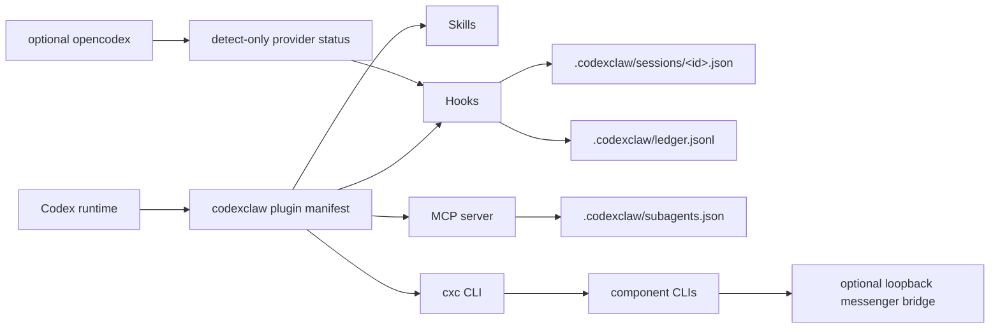

codexclaw is one plugin manifest that registers four kinds of surface with the Codex runtime,
mostly backed by project-local state under `.codexclaw/`.

## Skills

Skills carry the development discipline. Eight skills are implicit-visible in the shipped
`agents/openai.yaml` files: `dev`, `search`, `interview`, `pabcd`, `recall`, `loop`,
`dev-frontend`, and `dev-uiux-design`.
Everything else (`dev-backend`, `dev-testing`, `qa`, `repo-map`, `ast-grep`, ...) loads on
demand by explicit mention, trigger match, or `cxc-dev` routing. The skill hub is a catalog, not
a runtime loader. See the [Skills guide](/codexclaw/guides/skills/).

## Hooks

Eighteen active hooks connect Codex lifecycle events to codexclaw state, covering session start,
orchestration, recall injection, pre/post-tool guards, subagent evidence, and compaction
recovery:

| Event | Hooks | Role |
|---|---|---|
| `SessionStart` (x4) | provider-bridge, pabcd-bootstrap, map-affordance, recall-context | Detect `ocx` status; bootstrap session state; announce `cxc map`; inject recall context. |
| `UserPromptSubmit` (x2) | pabcd-trigger, recall-intent | Parse orchestrate grammar and inject phase directives; detect recall phrasing. |
| `Stop` | pabcd-continuation | Keep an in-flight cycle advancing under an active goal. |
| `PreToolUse` (x5) | goal-budget, interview-in-goal, goal-complete, skill-attach, edit-lint | Guard goals, deny interview in goal mode, gate goal completion, attach skills to spawns, lint edits. |
| `PostToolUse` (x2) | interview-capture, render-observations | Capture interview answers; track render observations. |
| `SubagentStop` | evidence-verify | Verify subagent evidence bundles. |
| `PostCompact` (x3) | reinject-cursor, recall-context, bg-terminal-affordance | Recover PABCD state, recall context, and affordance notes after context compaction. |

Full matchers and timeouts are in the [Hooks reference](/codexclaw/reference/hooks/).

## MCP server

The subagent-config MCP server exposes `subagents_get`, `subagents_set`, and `catalog_list`. It
reads and writes role → model/prompt config in `.codexclaw/subagents.json`. See the
[MCP Tools reference](/codexclaw/reference/api-mcp/).

## CLI

The `cxc` / `codexclaw` binary is a thin delegator over the compiled component CLIs:
`enable` / `disable` / `uninstall` / `status` route to config-guard, `doctor` / `reset` to
cxc-ops, `orchestrate` / `freeze` / `metric` / `divergence` / `loop` / `goalplan` to
pabcd-state, `chat` / `memory` to recall, `skill search` / `skill show` to skill-search, `map`
to the repo-map skill, `subagents` to subagent-config, `provider` to provider-bridge,
`serve` / `service` to messenger-bridge, and `gui` to the Vite dashboard. See the
[Commands reference](/codexclaw/reference/commands/).

The CLI has two tiers for v0.1.1. The marketplace payload ships its own dispatcher at
`bin/cxc.mjs`, so every install can run `node "<pluginRoot>/bin/cxc.mjs" <command>` — the
SessionStart banner prints the exact resolved invocation when `cxc` is not on `PATH`. Placing
`cxc` itself on `PATH` remains a repo-checkout convenience (npm link or a shell alias).

## Components

Eight component packages provide the CLI, hook, MCP, search, and bridge implementations. The
dashboard GUI is a separate workspace package.

| Component | Role |
|---|---|
| `config-guard` | Enable/disable/status for declared Codex feature flags. |
| `cxc-ops` | `doctor` and scoped `.codexclaw/` reset helpers. |
| `pabcd-state` | IPABCD state machine, hooks, goal gates, and phase CLI. |
| `provider-bridge` | Read-only `ocx` provider detection. |
| `subagent-config` | MCP tools and per-role model/prompt store. |
| `recall` | Read-only past chat/memory search over Codex-owned artifacts. |
| `messenger-bridge` | Optional loopback GUI/API relay from Telegram/Discord to stock `codex exec`. |
| `skill-search` | Remote dormant-skill search/show over jaw, hermes, clawhub, and GitHub sources. |

## File state

All durable state lives under the project `.codexclaw/` directory — session JSON, the append-only
transition ledger, the interview scan-evidence ledger, subagent config, and, when `cxc serve` is
opted in, `.codexclaw/bridge.db`. Recall also keeps a rebuildable user-level search cache under
`~/.codexclaw`. See the [State Model](/codexclaw/concepts/state-model/).
