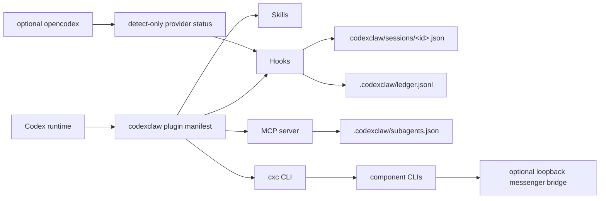

codexclaw is one plugin manifest that registers four kinds of surface with the Codex runtime,
mostly backed by project-local state under `.codexclaw/`.

## Skills

Skills carry the development discipline. `cxc-dev` is the implicit, always-on classifier; the
rest (`dev-frontend`, `dev-testing`, `pabcd`, `loop`, `interview`, `ast-grep`, ...) load on
demand. The skill hub is a catalog, not a runtime loader. See the
[Skills guide](/codexclaw/guides/skills/).

## Hooks

Seventeen hooks connect Codex lifecycle events to codexclaw state, covering session start,
orchestration, pre/post-tool guards, subagent evidence, and compaction recovery:

| Event | Hooks | Role |
|---|---|---|
| `SessionStart` (×3) | provider-bridge, project-rules, recall-advertise | Detect `ocx` status; surface project rules; advertise recall. |
| `UserPromptSubmit` (×2) | pabcd-trigger, recall-suggest | Parse orchestrate grammar and inject phase directives; suggest recall on past-work prompts. |
| `Stop` | pabcd-continuation | Keep an in-flight cycle advancing under an active goal. |
| `PreToolUse` (×5) | goal-budget, interview-in-goal, skill-attach, friction-advise, edit-lint | Guard goals, deny interview in goal mode, attach skills to spawns, check friction, lint edits. |
| `PostToolUse` (×3) | interview-capture, friction-record, edit-shape | Capture interview answers; record shell friction; watch repeated edit shapes. |
| `SubagentStop` | evidence-verify | Verify subagent evidence bundles. |
| `PostCompact` (×2) | reinject-cursor, recall-suggest | Recover PABCD state after context compaction; suggest recall after context loss. |

Full matchers and timeouts are in the [Hooks reference](/codexclaw/reference/hooks/).

## MCP server

The subagent-config MCP server exposes `subagents_get`, `subagents_set`, and `catalog_list`. It
reads and writes role → model/prompt config in `.codexclaw/subagents.json`. See the
[MCP Tools reference](/codexclaw/reference/api-mcp/).

## CLI

The `cxc` / `codexclaw` binary is a thin delegator over the compiled component CLIs:
`enable` / `disable` / `status` route to config-guard, `doctor` / `reset` to cxc-ops,
`orchestrate` / `freeze` / `metric` / `divergence` / `goalplan` to pabcd-state,
`chat search` / `memory search` to recall, `subagents` to subagent-config, `provider` to
provider-bridge, `serve` / `service` to messenger-bridge, and `gui` to the Vite dashboard. See
the [Commands reference](/codexclaw/reference/commands/).

## Components

Seven component areas provide the CLI, hook, MCP, GUI, and bridge implementations:

| Component | Role |
|---|---|
| `config-guard` | Enable/disable/status for declared Codex feature flags. |
| `cxc-ops` | `doctor` and scoped `.codexclaw/` reset helpers. |
| `pabcd-state` | IPABCD state machine, hooks, goal gates, and phase CLI. |
| `provider-bridge` | Read-only `ocx` provider detection. |
| `subagent-config` | MCP tools and per-role model/prompt store. |
| `recall` | Read-only past chat/memory search over Codex-owned artifacts. |
| `messenger-bridge` | Optional loopback GUI/API relay from Telegram/Discord to stock `codex exec`. |

## File state

All durable state lives under the project `.codexclaw/` directory — session JSON, the append-only
transition ledger, the interview scan-evidence ledger, subagent config, and, when `cxc serve` is
opted in, `.codexclaw/bridge.db`. Recall also keeps a rebuildable user-level search cache under
`~/.codexclaw`. See the [State Model](/codexclaw/concepts/state-model/).
