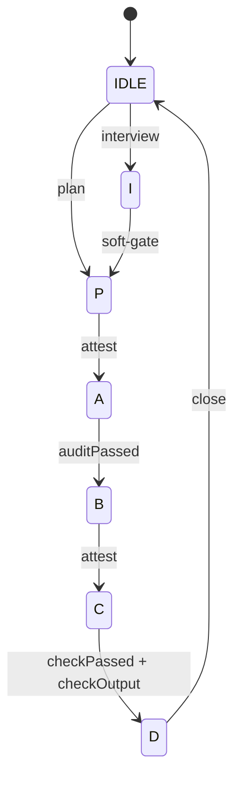

PABCD is codexclaw's work loop: Plan → Audit → Build → Check → Done, with an optional Interview
phase up front (IPABCD). The same file state backs every way you drive it.



## Three ways to drive it

1. **Natural-language trigger** — describe planning/auditing/building work and the
   `UserPromptSubmit` hook injects the matching phase directive.
2. **Chat orchestrate grammar** — type `orchestrate <phase>` (or `$cxc-orchestrate`) in chat. A
   human chat command is a free-pass source.
3. **`cxc orchestrate` CLI** — the agent/CLI path is attest-gated.

## The attest gate

Forward transitions require an `--attest` block; narration alone does not advance the state. A
plain `cxc orchestrate <phase>` from an agent without attestation is rejected.

```bash
cxc orchestrate A --attest '{"from":"P","to":"A","did":"the plan you wrote"}'
```

The `C → D` transition additionally needs the check output and a zero exit code:

```bash
cxc orchestrate D --attest '{"from":"C","to":"D","did":"what you checked","checkOutput":"289/289 pass","exitCode":0}'
```

## Human free-pass vs agent gate

- A **human chat** command transitions freely (`actor: "human"`), and a human may override the
  `I → P` soft-gate. The override and its scan evidence are recorded in the ledger.
- An **agent / CLI** transition (`actor: "agent"`) is attest-gated and cannot rubber-stamp a
  phase.

## D is a closing action

`D` closes the cycle and returns the phase to `IDLE`. It is not a resting badge — you should not
see a session sitting at `D`. Inspect or reset any time:

```bash
cxc orchestrate status
cxc orchestrate reset
```

## Stop continuation

Under an **active native goal**, the `Stop` hook returns
`{"decision":"block","reason":...}` to keep the agent advancing — both mid-cycle
(continue the current phase) and at IDLE with no in-flight cycle
(GOAL-IDLE-CONTINUE-01: arm the next work-phase with `cxc orchestrate P` or close the
goal honestly). Termination stays total via three guards:

- **No active goal** — a plain interactive session never enters the loop (IDLE or
  mid-cycle without a goal pauses for the human).
- **Context-pressure bail** — do not pile on during compaction recovery.
- **Stagnation cap** — after a bounded number of consecutive blocks at the same phase with no
  transition, the loop releases. A real transition resets the counter. This cap is the
  single total-termination bound: the old unconditional `stop_hook_active` release was
  removed (it capped an armed loop at one continuation per turn).

`update_goal {status:"complete"}` is gated deterministically (GOAL-COMPLETE-GATE-01):
a PreToolUse hook denies it while a PABCD cycle is in flight, or while a session-bound
goalplan fails the E8 `cxc loop validate` gate (unmet criteria, undone work phases,
evidence-free `met` marks, or an empty unregistered plan). `status:"blocked"` always
passes as the honest escape hatch.
