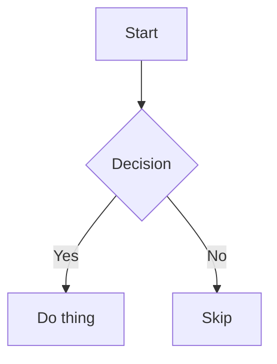

# Dev-Diagram-Viewer — Environment-Aware Diagram Rendering

Route diagram, chart, and visualization output to the correct rendering surface
based on the detected runtime environment. This skill is on-demand: it activates
by description match or explicit `$cxc-dev-diagram-viewer` mention.

> **C0/C1 work (small local patches):** See `dev` §0.0 Work Classifier + §0.1 Patch Fast-Path before reading references.

> **`dev` is canonical:** `dev` §0.2 Rule Classes, §3 Verification Gate, and §5 Safety Rules apply to all work governed by this skill.

## Reference Files

- `reference/environment-detection.md` — environment detection signals and decision tree
- `reference/html-templates.md` — HTML wrapper templates for all diagram types

## Why This Skill Exists

Different Codex surfaces support different rendering capabilities:

| Surface | Mermaid | Inline SVG | HTML Widgets | Chart.js/ECharts | Interactive |
|---------|---------|------------|--------------|------------------|-------------|
| Codex Desktop app | native | no | no | no | no |
| CLI (jaw Web UI) | native | native | native | native | native |
| CLI (terminal) | ASCII fallback | no | no | no | no |

When the agent produces a diagram type that the current surface cannot render
natively, this skill wraps the content in a self-contained HTML file and opens
it in a browser — making every diagram type work everywhere.

## Environment Detection (read first)

Detect the runtime environment before choosing the delivery path. Use these
signals in priority order:

### Signal 1: Environment Variable (most reliable)

```bash
echo $CODEX_INTERNAL_ORIGINATOR_OVERRIDE
```

| Value | Environment |
|-------|-------------|
| `Codex Desktop` | Codex Desktop app (Electron) |
| absent or other | CLI environment |

### Signal 2: System Prompt Context (implicit)

The Codex Desktop app injects an `<app-context>` block into the system prompt
containing `# Codex desktop context`. This block includes directives for image
rendering, mermaid support, `::code-comment`, and `::git-*` directives. Its
presence confirms the Desktop app environment.

The system prompt also states:
> Use mermaid diagrams to represent complex diagrams, graphs, or workflows.

This confirms mermaid is natively rendered in the app.

### Signal 3: Supplementary Checks

| Signal | Desktop app | CLI |
|--------|-------------|-----|
| `__CFBundleIdentifier` | `com.openai.codex` | absent |
| `TERM` | `dumb` | `xterm-256color` etc. |
| `PATH` contains `ChatGPT.app` | yes | no |
| Browser plugin available | `browser:control-in-app-browser` listed | not listed |

For full detection logic, see `reference/environment-detection.md`.

## Routing Table

After detecting the environment, route each diagram type:

### Codex Desktop App

| Diagram Type | Delivery | Method |
|---|---|---|
| Mermaid (any type) | **Native pass-through** | Output ` ```mermaid ` code block directly in response |
| Inline SVG | **Browser render** | Wrap in HTML, open in browser |
| Chart.js / ECharts / D3 | **Browser render** | Wrap in HTML with CDN, open in browser |
| Leaflet map | **Browser render** | Wrap in HTML with CDN, open in browser |
| Three.js / p5.js / Matter.js | **Browser render** | Wrap in HTML with CDN, open in browser |
| Interactive widget (sliders etc.) | **Browser render** | Wrap in HTML, open in browser |
| jaw `diagram-html` / `diagram-file` | **Browser render** | Extract HTML content, wrap, open in browser |

### CLI Environment

| Diagram Type | Delivery | Method |
|---|---|---|
| All types | **Browser render** | Wrap in HTML, open with `open` command (macOS) |

> In CLI with jaw Web UI running, the native jaw renderer handles everything.
> This skill activates in CLI only when jaw Web UI is not the active surface
> (e.g., direct Codex CLI, plain terminal).

## Delivery Workflow

### Step 1: Generate the Diagram Content

Produce the diagram source as you normally would — mermaid syntax, raw SVG
markup, Chart.js JavaScript, etc. For Mermaid in Codex Desktop, output it
directly and stop (native rendering handles it).

### Step 2: Wrap in HTML (when browser render is needed)

Save a self-contained HTML file to the tmp directory:

```bash
# Preferred tmp path
/tmp/codex-diagrams/<session-id>-<diagram-id>.html

# Create the directory if needed
mkdir -p /tmp/codex-diagrams
```

Use the templates in `reference/html-templates.md` to wrap the content.
Every HTML file must be:
- **Self-contained**: all dependencies loaded via CDN
- **Theme-aware**: dark mode by default, light mode toggle available
- **Responsive**: works on any viewport
- **Zero-config**: opens and renders with no server needed

### Step 3: Open in Browser

#### Primary Method (All Environments on macOS)

Open the generated file in the system's default browser. This works from both
Codex Desktop and CLI environments on macOS:

```bash
open /tmp/codex-diagrams/<filename>.html
```

On Linux, use the platform equivalent:

```bash
xdg-open /tmp/codex-diagrams/<filename>.html
```

#### Enhancement (Codex Desktop Only)

Optionally use the Browser plugin to capture screenshots for an inline preview.
The in-app browser rejects `file://` URLs, so first serve the output directory
over local HTTP:

```bash
cd /tmp/codex-diagrams
python3 -m http.server 8765
```

Then navigate to `http://127.0.0.1:8765/<filename>.html`. Do not assume tab
creation or navigation method names: select the Browser plugin binding, read the
complete API returned by `browser.documentation()`, and use the operations
documented for that binding. The same rule applies to taking screenshots for
inline preview.


### Step 4: Notify the User

After opening the diagram in the browser, inform the user:

- Mention that the diagram is open in the browser
- Provide the file path as a clickable link: `[diagram.html](/tmp/codex-diagrams/<filename>.html)`
- If in Codex Desktop with in-app browser, mention it opened in the side panel

## Diagram Type Detection

When producing output, classify the diagram type to choose the correct route:

| Content Pattern | Type | Route (Desktop) |
|---|---|---|
| ` ```mermaid ` fence | Mermaid | Native |
| `<svg` tag or SVG markup | Inline SVG | Browser |
| `new Chart(` or Chart.js patterns | Chart.js | Browser |
| `echarts.init` or ECharts patterns | ECharts | Browser |
| `L.map(` or Leaflet patterns | Leaflet map | Browser |
| `new THREE.` or Three.js patterns | Three.js 3D | Browser |
| `new p5(` or p5.js patterns | p5.js creative | Browser |
| `Matter.Engine` or Matter.js patterns | Physics sim | Browser |
| `d3.select` or D3 patterns | D3 visualization | Browser |
| `Tone.` or Tone.js patterns | Audio viz | Browser |
| ` ```diagram-html ` fence | jaw widget | Browser |
| ` ```diagram-file ` fence | jaw file widget | Browser |

## HTML Generation Rules

When wrapping diagram content in HTML:

1. **Dark theme by default** — use `background: #0f172a; color: #e2e8f0`
2. **CDN sources** — load libraries from `cdn.jsdelivr.net` or `cdnjs.cloudflare.com`
3. **Error handling** — add `onerror` fallbacks for CDN loads
4. **Viewport meta** — include `<meta name="viewport" content="width=device-width, initial-scale=1">`
5. **Charset** — always `<meta charset="utf-8">`
6. **No external images** — embed everything inline
7. **Title** — set `<title>` to describe the diagram content

### CDN Library Reference

| Library | CDN URL | Version |
|---|---|---|
| Mermaid | `https://cdn.jsdelivr.net/npm/mermaid@11/dist/mermaid.esm.min.mjs` | 11.x |
| Chart.js | `https://cdn.jsdelivr.net/npm/chart.js@4/dist/chart.umd.min.js` | 4.x |
| ECharts | `https://cdn.jsdelivr.net/npm/echarts@6/dist/echarts.min.js` | 6.x |
| D3 | `https://cdn.jsdelivr.net/npm/d3@7/dist/d3.min.js` | 7.x |
| Three.js | `https://cdn.jsdelivr.net/npm/three@0.185/build/three.module.min.js` | 0.185.x |
| Leaflet CSS | `https://cdn.jsdelivr.net/npm/leaflet@1/dist/leaflet.min.css` | 1.x |
| Leaflet JS | `https://cdn.jsdelivr.net/npm/leaflet@1/dist/leaflet.min.js` | 1.x |
| p5.js | `https://cdn.jsdelivr.net/npm/p5@2/lib/p5.min.js` | 2.x |
| Matter.js | `https://cdn.jsdelivr.net/npm/matter-js@0.20/build/matter.min.js` | 0.20.x |
| Tone.js | `https://cdn.jsdelivr.net/npm/tone@15/build/Tone.js` | 15.x |

> Pin to major versions for stability. See `reference/html-templates.md` for
> complete wrapper templates per library.

## Mermaid Native Pass-Through (Codex Desktop)

When in Codex Desktop, output mermaid directly — no wrapping needed:

````

````

Mermaid 11.16 stable types work natively:
`flowchart`, `sequenceDiagram`, `classDiagram`, `stateDiagram-v2`,
`erDiagram`, `gantt`, `pie`, `mindmap`, `timeline`, `journey`,
`gitGraph`, `quadrantChart`, `block`, `kanban`, `packet`, `sankey`,
`xychart`, `ishikawa`, `requirementDiagram`, `zenuml`.

Beta types require their suffix:
`radar-beta`, `architecture-beta`, `treemap-beta`, `venn-beta`,
`wardley-beta`, `treeView-beta`, `cynefin-beta`, `swimlane-beta`.

Do NOT use `C4Context`, `C4Container` etc. — dark mode text is unreadable
(mermaid #4906). Substitute with `flowchart` + subgraphs or structural SVG
via browser render.

## Combined Output Pattern

When a response includes both text explanation and a non-mermaid diagram:

1. Write the text explanation in the response
2. Generate and save the HTML file
3. Open it in the browser
4. Reference the diagram with a file link in the response

Example flow:
```
Agent response text explaining the architecture...

[Architecture diagram](/tmp/codex-diagrams/arch-001.html) (opened in browser)
```

Do NOT put SVG markup or HTML widget code directly in the Codex Desktop
response — it will not render. Always route through the browser path.

## Screenshot Capture (optional enhancement)

After opening a diagram through local HTTP in the in-app browser, optionally
capture a screenshot and embed it in the response for inline visibility. Read
the complete `browser.documentation()` output first and use the screenshot API
documented by the selected browser binding.

This gives the user both:
- An inline preview in the chat (screenshot image)
- An interactive version in the browser (full HTML)

Use this when the diagram has important detail that benefits from being
visible directly in the conversation.

## Interaction with Other Skills

### `cxc-dev` (parent router)
This skill is a leaf under the `dev` family. It follows `dev` §0.0 work
classification. Mermaid native pass-through is C0 because it emits only a code
fence with no executable content. Diagram rendering that produces executable
HTML, including Chart.js, ECharts, and interactive widgets, is C1. Browser-rendered
content with CDN scripts is also C1: it is a single-file local behavior change,
but the output is executable.

### `diagram` skill (cli-jaw)
When the cli-jaw `diagram` skill is active (jaw Web UI context), defer to it
entirely — it has native rendering for all types. This skill activates only
when jaw's native renderer is not available (Codex Desktop, plain CLI terminal).

### `browser:control-in-app-browser`
This skill can optionally use the Browser plugin for HTTP-served local HTML and
screenshot capture in Codex Desktop. Follow the Browser skill's bootstrap and
documented tab-management patterns. Do not re-initialize if a browser binding
already exists.

### `visualize` skill (Codex bundled)
The bundled `visualize` skill creates interactive tools in conversation. When
it covers the diagram type, this router delegates delivery to it. Use this
skill's native paths when the diagram type is not covered by `visualize` or when
cli-jaw diagram compatibility is needed.

## When NOT to Use

- Plain text answers (no visual needed)
- Code review / debugging (code blocks are clearer)
- Mermaid in Codex Desktop (native — just output the fence)
- jaw Web UI is the active surface (jaw handles rendering natively)
- User explicitly asks for text-only explanation

## Quick Reference

```
Environment?
  |
  +-- Codex Desktop
  |     |
  |     +-- Mermaid? --> Output ```mermaid fence (native)
  |     |
  |     +-- Anything else? --> HTML file --> Browser
  |           |
  |           +-- Primary --> open command
  |           +-- Optional inline preview? --> Local HTTP + Browser plugin
  |
  +-- CLI
        |
        +-- jaw Web UI active? --> Defer to jaw diagram skill
        |
        +-- No jaw? --> HTML file --> open command
```

## Render Verification (DIAGRAM-RENDER-VERIFY-01, DEFAULT)

Source: sol research (dev-skill reinforcement audit, Euler findings).

Every diagram or visualization delivered to the user must be verified as
non-blank and correctly rendered:

1. After generating the HTML/SVG output, open it in a browser (in-app browser
   or headless screenshot).
2. Capture a screenshot and inspect it with `view_image`.
3. Verify: the canvas/SVG is non-blank, text is readable, no rendering errors.
4. For interactive visualizations (Three.js, p5.js, Chart.js): verify the
   initial state renders correctly; interaction verification is optional.

Do not claim a diagram is correct from source inspection alone. Static
analysis confirms well-formed files; it does not prove visual correctness.

## Syntax Validation (DIAGRAM-SYNTAX-01, DEFAULT)

Before rendering, validate syntax where tooling exists:
- Mermaid: `npx @mermaid-js/mermaid-cli parse` or equivalent
- SVG: XML well-formedness check
- HTML templates: `bash -n` for shell scripts, basic markup validation
- Chart.js/ECharts: JSON schema validation of config objects

Catch syntax errors before the user sees a blank page.

## Accessibility Contract (DIAGRAM-A11Y-01, DEFAULT)

Diagrams and visualizations must be accessible:
- Every `<svg>` has a `<title>` and `<desc>` (or `aria-label`)
- Charts have text alternatives (data table, `aria-label`, or caption)
- Interactive elements are keyboard-navigable
- Color is not the sole information channel (use patterns, labels, or shapes)
- Respect `prefers-reduced-motion` for animated visualizations
- Provide sufficient contrast for text and important visual elements
