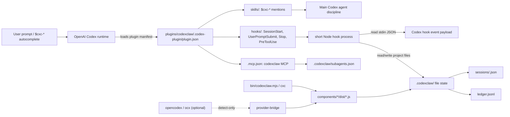

# Codexclaw Architecture Reference

> codexclaw 프로젝트의 구조 허브. Start here for the single-plugin shape, the Codex runtime boundary, component responsibilities, skills/hooks/CLI surfaces, and the `.codexclaw/` state model.
>
> Planning state lives under `devlog/_plan/`: `mvp_res/` is the shipped MVP source-of-record, while `mvp_hard/` is the parity-hardening track.

---

## structure/ SOT 파일

This directory is the maintainer source of truth for the current system shape and the
design philosophy behind it (opencodex-style flat SOT). `INDEX.md` is the "what is
where" hub; the numbered files carry the durable reasoning.

| File | Purpose |
| --- | --- |
| [`INDEX.md`](INDEX.md) | Architecture hub: component/skill/hook/CLI/state map (this file). |
| [`00_philosophy.md`](00_philosophy.md) | Implementation philosophy: boundary invariants, the model-autonomy vs runtime-enforcement tension, truthfulness regime, HITL/HOTL split, subagent doctrine. |
| [`10_subagent_skill_routing.md`](10_subagent_skill_routing.md) | L14 design SOT: attaching `cxc-*` skills to subagent spawns + loop/goal handoff hardening. |
| [`20_pabcd_dispatch_doctrine.md`](20_pabcd_dispatch_doctrine.md) | PABCD + dispatch + routing operating doctrine inherited from cli-jaw, translated to a serverless plugin. |
| [`30_contradiction_register.md`](30_contradiction_register.md) | Truth table of doc↔code contradictions (claim vs reality, file:line), the input to L14 + any status-sync gate. |
| [`40_enforcement_methods.md`](40_enforcement_methods.md) | Enforcement ladder E1-E8: how strongly each intent can be enforced given the four Codex hook surfaces, and which tier to pick per contradiction. |
| [`50_emergence_gap.md`](50_emergence_gap.md) | Why PABCD is a convergence (exploitation) machine with no divergence/plateau surface — the structural weakness on emergent/algorithmic tasks (NYPC 3.5/8 diagnosis), with an honest E-tier fix taxonomy. |
| [`60_native_capabilities.md`](60_native_capabilities.md) | Live-verified Codex native capability matrix (browser/computer use, deferred `multi_agent_v1.*` collab tools behind `tool_search`, `update_plan`, `view_image`, `imagegen`, flag-gated CSV fan-out) and the per-skill gap map the WP-N track patches. |

Writing rule: keep this directory flat. Add or extend lexicographically ordered
`NN_topic.md` files (`00-09` philosophy/foundations, `10-19` subagent/routing, and so
on); do not nest subfolders. When code and SOT disagree, fix the code or amend the SOT
in the same change — never leave them silently divergent.

---

## 시스템 개요



codexclaw is a **single Codex plugin**, not a server. It reuses the OpenAI `codex` runtime and layers cli-jaw-style development discipline onto Codex through skill mentions, hooks, file state, subagent prompts, and the `cxc` CLI. There are no jaw employees, no boss token, no external orchestrator server, and no plugin-defined `/` slash commands; `/` commands live in the Codex runtime, while codexclaw's discovery surface is `$cxc-*` skills plus hook-triggered context injection. The one scoped exception is the opt-in loopback messenger bridge (`cxc serve`, `00_philosophy.md` §2): a relay to stock `codex exec`, not an orchestrator.

opencodex (`ocx`) is adjacent but optional. opencodex is a local provider proxy that can inject `model_provider = "opencodex"` into Codex config and serve `/v1/responses`; codexclaw only detects `ocx` status through `provider-bridge` and never vendors or auto-configures opencodex.

---

## 읽기 순서

| Tier | 문서 / code | 핵심 내용 |
|:----:|-------------|-----------|
| **1 — Foundation** | `README.md`, `plugins/codexclaw/.codex-plugin/plugin.json`, `devlog/_plan/mvp_res/000_INDEX.md` | single plugin boundary, manifest surfaces, shipped MVP ledger |
| **2 — Runtime Flow** | `plugins/codexclaw/hooks/*.json`, `plugins/codexclaw/components/pabcd-state/src/hook.ts`, `plugins/codexclaw/components/pabcd-state/src/goal-gate.ts`, `plugins/codexclaw/components/pabcd-state/src/cli.ts` | Codex hook events -> short Node process -> additionalContext or deny envelope |
| **3 — State + CLI** | `plugins/codexclaw/components/pabcd-state/src/state.ts`, `fsm.ts`, `bin/codexclaw.mjs`, `plugins/codexclaw/components/cxc-ops/src/*.ts` | `.codexclaw/` session files, phase legality, `cxc` command delegation |
| **4 — Capabilities** | `plugins/codexclaw/skills/`, `plugins/codexclaw/agents/`, `plugins/codexclaw/components/subagent-config/src/` | `$cxc-*` skill family, inline subagent roles, model/prompt config |
| **5 — Context** | `devlog/_plan/mvp_res/`, `devlog/_plan/mvp_hard/`, `../opencodex/README.md`, `../opencodex/src/codex-inject.ts` | shipped MVP vs hardening work, optional host/provider proxy relationship |

> Tier 1 -> 3 gives the live runtime shape. Tier 4 explains how users and subagents experience it. Tier 5 is for historical decisions and parity gaps.

---

## 문서 맵

| Area | Source of truth | 키워드 |
|------|-----------------|--------|
| Plugin manifest | `plugins/codexclaw/.codex-plugin/plugin.json` | skills, hooks, MCP, plugin metadata |
| CLI entry | `bin/codexclaw.mjs` | `cxc`, delegation, ops commands |
| Hooks | `plugins/codexclaw/hooks/*.json` | Codex hook event wiring |
| PABCD state | `plugins/codexclaw/components/pabcd-state/src/` | IPABCD FSM, state files, directives, goal gates |
| Feature activation | `plugins/codexclaw/components/config-guard/src/` | Codex feature flags, backup, revert manifest |
| Ops helpers | `plugins/codexclaw/components/cxc-ops/src/` | doctor, reset |
| Recall search | `plugins/codexclaw/components/recall/src/` | read-only chat/memory search over `~/.codex` |
| Provider bridge | `plugins/codexclaw/components/provider-bridge/src/` | ocx detect-only bridge |
| Subagent config | `plugins/codexclaw/components/subagent-config/src/` | role model/prompt config, MCP tools, catalog |
| Messenger bridge | `plugins/codexclaw/components/messenger-bridge/src/` | loopback GUI/API server, messenger agents, project bridge DB |
| Skills | `plugins/codexclaw/skills/` | `$cxc-*`, display_name autocomplete, dev routers |
| Subagent roles | `plugins/codexclaw/agents/` | explorer, reviewer, executor inline prompts |

---

## Component Map

### `components/config-guard`

Controlled activation for the Codex features codexclaw needs. `src/features.ts` declares `multi_agent`, `goals`, `hooks`, and soft `default_mode_request_user_input`; it parses `codex features list` output by exact feature name. `src/activate.ts` backs up `config.toml`, enables only missing declared flags through the official `codex features enable`, and writes `.codexclaw-install.json` under Codex home. `src/deactivate.ts` reverts only flags codexclaw enabled and refuses blind revert if the config hash drifted. `src/cli.ts` is the production binding that resolves `CODEX_HOME` / `~/.codex` and shells out to `codex`.

### `components/cxc-ops`

Local operations that do not require a codexclaw server. `src/doctor.ts` checks manifest parseability, hook file presence, skill metadata, agent TOMLs, MCP config drift, and optional ast-grep availability. `src/reset.ts` removes only scoped `.codexclaw/` working state: `--state`, `--generated`, or `--all`. `src/cli.ts` dispatches `doctor` and `reset` (unknown subcommands print usage and exit 0). The former `chat-search` wrapper was retired (D1', mvp_hard L13/WP1): Codex app-server `thread/search` has no native CLI/agent surface, so wrapping it made codexclaw a self-implemented search surface; public-web lookups route through the `cxc-search` skill. Past-session recall was later re-scoped by owner directive (2026-07-02, `devlog/_plan/260702_codex_recall/`): the `recall` component reads Codex-native disk artifacts directly — a different mechanism than the retired app-server wrapper, which stays a non-goal.

### `components/messenger-bridge`

Loopback bridge for the dashboard and messenger agents. `src/cli.ts` dispatches `serve` and `service`: `serve` opens the project-scoped bridge DB, creates the HTTP server on `127.0.0.1`, starts enabled adapters through `BridgeController`, and shuts down the scheduler/controller/server/DB in order; `service` installs, uninstalls, or reports a macOS launchd daemon for `cxc serve`. `src/server.ts` serves the built GUI plus JSON API routes (`health`, compatibility, connect/manage, agents), with local Host and mutating-request guards. `src/db.ts` owns `.codexclaw/bridge.db` via `node:sqlite`, including channels, allowlists, bindings, jobs, named agents, and migrations. `src/agent-service.ts` serializes per-binding Codex turns, records jobs, persists thread ids, and terminates active child processes on shutdown.

### `components/recall`

Read-only recall search over the Codex session root (`CODEX_HOME`, default `~/.codex`); never writes. `src/rollout.ts` walks `sessions/YYYY/MM/DD/rollout-*.jsonl` with directory-date pruning, classifies main vs subagent rollouts from the `session_meta` first line (grow-until-newline head reads survive 40KB meta lines), filters harness-injected synthetic user messages, and extracts message + tool-log entries. `src/chat-search.ts` runs AND-default (OR with `--any`) case-insensitive word matching with file-level prefilter, exact per-message `--days` cutoff, cwd/role/source filters, context windows, and a truncation warning at the 200-cap limit. `src/threads-db.ts` enriches hits from the `threads` table (title, git branch) via a lazily-required read-only `node:sqlite` handle, degrading to a warning when unavailable. `src/memory-search.ts` paragraph-scans `memories/**/*.md` plus `stage1_outputs` in `memories_<N>.sqlite` with md/db thread dedupe. `src/cli.ts` dispatches `[chat|memory, "search"|"index", ...]` (jaw-style text or `--json`).

WP2 sidecar index: chat search is served by default from a rebuildable derived cache at `$CODEXCLAW_HOME ?? ~/.codexclaw` + `/recall/index.sqlite` — the one codexclaw surface that is user-level rather than project-local `.codexclaw/`, because sessions span all projects (`devlog/_plan/260702_codex_recall/20_wp2_index.md`). `src/index-db.ts` owns the schema (msgs content table + trigger-synced `msgs_fts` unicode61 and `msgs_tri` trigram external-content FTS5 tables; version drift drops and rebuilds). `src/ingest.ts` re-ingests only files whose (mtime,size) changed, prunes vanished files, and caps tool outputs at 8KB. `src/index-search.ts` compiles the WP1 filter set to SQL — trigram MATCH for >=3-char words (substring semantics, CJK-capable), LIKE fallback below — with refresh-on-query keeping results live (measured: full build 1,533 files/326k msgs in ~161s once; queries ~20-40ms full-history vs 2-16s scans; ~2.1GB disk). `--scan` forces the JSONL path; index failure degrades to scan with a warning; `~/.codex` stays read-only either way.

### `components/pabcd-state`

The IPABCD file-state engine and hook logic. `src/state.ts` owns `Phase = "IDLE" | "I" | "P" | "A" | "B" | "C" | "D"`, `.codexclaw/sessions/<sessionId>.json`, and `.codexclaw/ledger.jsonl`. `src/fsm.ts` defines `nextPhase()`, legal entry checks, attest-gated A->B and C->D flag flips, and D->IDLE cycle close. `src/hook.ts` detects explicit prompt triggers, injects phase directives or compact stage headers through `additionalContext`, and runs the bounded Stop-continuation block only for an active goal plus an in-flight cycle. `src/goal-gate.ts` handles PreToolUse denials for budgeted `create_goal` calls and goal-mode `request_user_input`. `src/cli.ts` is the hook stdin/stdout process and `freeze` / `orchestrate` command entry.

Supporting files include `attest.ts` for evidence validation, `parse.ts` for hook payload parsing, `interview.ts` / `minds.ts` / `triage.ts` for interview readiness and contradiction support, `transcript.ts` for transcript-tail idempotency, and `freeze.ts` / `freeze-cli.ts` for freeze manifest handling.

### `components/provider-bridge`

opencodex detection, not opencodex management. `src/detect.ts` resolves whether `ocx` is on PATH and parses read-only `ocx status --json` into `provider`, `native`, or `error` status. `src/cli.ts` is the SessionStart hook / manual detect entry. It explicitly does not run `ocx ensure`, `ocx sync`, mutate Codex config, or fail the Codex session when ocx is absent.

### `components/subagent-config`

Per-role subagent model, reasoning-effort, and prompt configuration. `src/store.ts` reads/writes `.codexclaw/subagents.json` atomically for `explorer`, `reviewer`, and `executor`, defaulting each role to the main Codex model with inherited effort (`effort: null`; valid overrides are the catalog-supported values low/medium/high/xhigh). `src/catalog.ts` builds a selectable model catalog from the native Codex cache allowlist plus optional ocx-backed model ids, with native models first. `src/mcp.ts` serves a stdio MCP server with `subagents_get`, `subagents_set`, and `catalog_list` tools.

---

## Skills Map

codexclaw skills live under `plugins/codexclaw/skills/`. Their `agents/openai.yaml` `interface.display_name` values are the user-facing `$` autocomplete names; folder names are implementation paths. The implicit-visible set is `{dev, search, interview, pabcd, recall, skill-hub, loop}` (2026-07-05 expansion; metadata rows only — `dev` alone carries always-on body discipline). All `dev-*` routers and the remaining skills are on-demand and explicitly invokable.

| Skill display name | Folder | Role |
|--------------------|--------|------|
| `cxc-dev` | `skills/dev/` | always-on development discipline: classifier, modularity, verification, safety |
| `cxc-pabcd` | `skills/pabcd/` | Codex-native IPABCD workflow discipline |
| `cxc-interview` | `skills/interview/` | explicit I-phase entry and continuous contradiction-interview contract |
| `cxc-orchestrate` | `skills/orchestrate/` | explicit phase-control surface for chat and the live agent-gated `cxc orchestrate` CLI |
| `cxc-loop` | `skills/loop/` | HOTL repeated work-phase continuation contract |
| `cxc-goalplan` | `skills/goalplan/` | durable goalplan/checkpoint/quality-gate contract |
| `cxc-dev-architecture` | `skills/dev-architecture/` | module boundaries, circular deps, coupling, validation placement |
| `cxc-dev-backend` | `skills/dev-backend/` | API/server/database/backend operations guidance |
| `cxc-dev-data` | `skills/dev-data/` | pipelines, ETL/ELT, SQL, schema/data quality |
| `cxc-dev-debugging` | `skills/dev-debugging/` | root-cause debugging method |
| `cxc-dev-frontend` | `skills/dev-frontend/` | UI/frontend implementation |
| `cxc-dev-uiux-design` | `skills/dev-uiux-design/` | design judgment, UX states, logos/typography |
| `cxc-dev-testing` | `skills/dev-testing/` | test strategy, QA, CI gates |
| `cxc-qa` | `skills/qa/` | manual surface-driving QA gate: evidence matrix, adversarial classes, teardown receipts |
| `cxc-dev-code-reviewer` | `skills/dev-code-reviewer/` | review verdicts, findings, risk assessment |
| `cxc-dev-security` | `skills/dev-security/` | auth, secrets, validation, supply-chain/security review |
| `cxc-dev-devops` | `skills/dev-devops/` | containers, deploy, IaC, SRE/release surfaces |
| `cxc-dev-scaffolding` | `skills/dev-scaffolding/` | project/module scaffolding and structure audits |
| `cxc-search` | `skills/search/` | current/public lookup ladder and Korean search intent guard |
| `cxc-recall` | `skills/recall/` | past-session chat/memory recall before asking the user to repeat context |
| `cxc-skill-hub` | `skills/skill-hub/` | on-demand skill catalog router |
| `cxc-ast-grep` | `skills/ast-grep/` | AST-aware search/codemods using `sg` |
| `cxc-repo-map` | `skills/repo-map/` | ranked repo structure map (vendored RepoMapper: tree-sitter tags + PageRank) |
| `cxc-sparksearch` | `skills/sparksearch/` | cheap parallel public-web discovery lane that hands proof back to `cxc-search` |
| `cxc-ultraresearch` | `skills/ultraresearch/` | multi-wave research protocol with journal and claim-ledger proof discipline |

The `dev` hub routes by change surface toward on-demand `dev-*` skills. `skill-hub` documents the exposure model: `allow_implicit_invocation` controls auto-rendered skill visibility, while explicit `$skill` / path mention still works unless a skill is disabled. The `interview`, `orchestrate`, `loop`, and `goalplan` skills are discoverable contracts for hardening surfaces; their deeper runtime work is tracked in `devlog/_plan/mvp_hard/`.

---

## Hooks

The manifest wires 12 hook JSON files; `plugin.json` `hooks` and `hooks/*.json` are both authoritative and locked by `checkCounts`. Seven earlier advisory hooks were retired to `hooks/_deprecated/` in the 2026-07-05 hook diet (their rules were absorbed into the `dev` skill family).

| Hook event | Hook file | Command | Live behavior |
|------------|-----------|---------|---------------|
| `SessionStart` | `hooks/session-start-ensuring-provider-bridge.json` | `node "${PLUGIN_ROOT}/components/provider-bridge/dist/cli.js" hook session-start` | emits one ocx status JSON line; detect-only |
| `SessionStart` | `hooks/session-start-announcing-map-affordance.json` | `node "${PLUGIN_ROOT}/components/cxc-ops/dist/cli.js" hook session-start` | announces `cxc map` availability (a POINTER, not the map body) when the repo clears a source-file size gate; read-only, fail-silent |
| `UserPromptSubmit` | `hooks/user-prompt-submit-checking-pabcd-trigger.json` | `node "${PLUGIN_ROOT}/components/pabcd-state/dist/cli.js" hook user-prompt-submit` | detects explicit IPABCD triggers and injects phase context |
| `Stop` | `hooks/stop-checking-pabcd-continuation.json` | `node "${PLUGIN_ROOT}/components/pabcd-state/dist/cli.js" hook stop` | active only under a native goal + in-flight PABCD cycle; bounded by re-entry, IDLE/no-goal, context-pressure, and stagnation guards |
| `PreToolUse` `^create_goal$` | `hooks/pre-tool-use-guarding-goal-budget.json` | `node "${PLUGIN_ROOT}/components/pabcd-state/dist/cli.js" hook pre-tool-use` | denies `create_goal` inputs with keys other than `objective` |
| `PreToolUse` `^request_user_input$` | `hooks/pre-tool-use-guarding-interview-in-goal.json` | same pabcd-state CLI | denies user-input/interview tool use while native goal mode is active or unreadable |
| `PostToolUse` `^request_user_input$` | `hooks/post-tool-use-capturing-interview-answers.json` | same pabcd-state CLI | captures interview question/answer events to the ledger; in an interactive I-phase also reinjects the Mind-rescan directive as `additionalContext` (L18); never blocks |
| `SubagentStop` `^worker$` | `hooks/subagent-stop-verifying-evidence.json` | same pabcd-state CLI | verifies worker evidence expectations on subagent stop |
| `PreToolUse` `^spawn_agent$` | `hooks/pre-tool-use-attaching-skills.json` | `node "${PLUGIN_ROOT}/components/subagent-config/dist/spawn-attach-hook.js" hook pre-tool-use` | prepends link-form `$cxc-*` skill mentions to spawn messages; also injects the `.codexclaw/subagents.json` per-role model/`reasoning_effort` into `updatedInput` when the caller picked none |
| `PostCompact` | `hooks/post-compact-resetting-reinject-cursor.json` | `node "${PLUGIN_ROOT}/components/pabcd-state/dist/cli.js" hook post-compact` | resets reinjection cursor/stage context after compaction |
| `PreToolUse` `^(apply_patch|Write|Edit)$` | `hooks/pre-tool-use-linting-apply-patch.json` | `node "${PLUGIN_ROOT}/components/pabcd-state/dist/cli.js" hook pre-tool-use-lint` | lints structured edits before write/edit tool use |
| `PostToolUse` `^(view_image|browser:control-in-app-browser|chrome:control-chrome|computer-use:computer-use|apply_patch)$` | `hooks/post-tool-use-tracking-render-observations.json` | `node "${PLUGIN_ROOT}/components/pabcd-state/dist/cli.js" hook post-tool-use-render-observation` | tracks render/visual observation events for QA evidence |

Hook processes are intentionally short: read stdin JSON, reconstruct state, optionally write `.codexclaw/`, then print either nothing or one JSON hook envelope. `UserPromptSubmit` outputs `hookSpecificOutput.additionalContext`; `PreToolUse` can output `permissionDecision: "deny"` with a reason. Non-PreToolUse errors fail open to avoid blocking Codex; the goal-mode `request_user_input` guard is fail-closed.

---

## Quality Gate (E8)

`plugins/codexclaw/scripts/gate.mjs` (run via `npm run gate`, enforced by
`plugins/codexclaw/test/gate.test.mjs` so `npm test` fails on drift) holds three checks:

- `checkStatusSync`: every `mvp_hard/000_INDEX.md` ledger row's **decision-state** must equal
  the leading `Status:` token of its loop doc (the two-axis legend, `132_L13.2`, makes the
  loop-doc leading token the decision axis; parentheticals express impl and are not parsed).
  Status tokens are a LOCKED enum (`DONE|FROZEN|PLANNED|ANALYZED|DEFERRED|BLOCKED|PROPOSED|PARTIAL`).
  Rows decomposed inside a shared doc (L15/L16/L17 → `141`) are allowlisted in `NO_OWN_DOC`.
  L20 has its own loop doc (`200_L20_gap_register.md`) and is validated directly, not allowlisted.
- `checkForbiddenClaims`: NARROW false-enforcement phrases in `skills/**/SKILL.md` (e.g.
  "hook automatically loads the X skill") are violations unless the line carries a trailing
  `<!-- gate-ok: <reason> -->` escape for a genuinely hook-backed claim.
- `checkCounts`: the `.codex-plugin/plugin.json` `hooks[]` length must equal the number of
  `hooks/*.json` files (locks C7).

Test-script asymmetry (C9): the root `package.json` `test` glob is the single source of test
discovery; it already globs every component `test/` dir. Component packages do NOT each carry a
local `test` script by design — the root glob covers `provider-bridge`/`subagent-config` even
though they have no package-local `test` script. This asymmetry is intentional, not drift.

---

## CLI Surface

`package.json` exposes both `codexclaw` and `cxc`, with `cxc` as the preferred short alias. `bin/codexclaw.mjs` is a small delegator:

| Command | Delegates to | Notes |
|---------|--------------|-------|
| `cxc enable` | `components/config-guard/dist/cli.js enable` | activates declared Codex feature flags |
| `cxc uninstall` / `cxc disable` | `components/config-guard/dist/cli.js disable` | reverts only flags codexclaw enabled when safe |
| `cxc status` | `components/config-guard/dist/cli.js status` | prints declared feature enabled/disabled state |
| `cxc doctor` | `components/cxc-ops/dist/cli.js doctor` | plugin health report |
| `cxc reset` | `components/cxc-ops/dist/cli.js reset` | scoped `.codexclaw/` cleanup |
| `cxc chat-search` | RETIRED (D1', L13/WP1) | removed; native `thread/search` has no CLI/agent surface = non-goal; use `cxc-search` |
| `cxc chat search` | `components/recall/dist/cli.js chat search` | read-only recall over `~/.codex` rollout JSONL (owner re-scope 2026-07-02; not the retired app-server wrapper) |
| `cxc memory search` | `components/recall/dist/cli.js memory search` | read-only search over `~/.codex/memories` + `stage1_outputs` |
| `cxc gui` | `plugins/codexclaw/gui` via `npm run dev` | starts the Vite dashboard when deps exist |
| `cxc orchestrate` | `components/pabcd-state/dist/cli.js orchestrate` | agent-gated terminal phase control over the same `.codexclaw/` session files |
| `cxc freeze` | `components/pabcd-state/dist/cli.js freeze` | freezes the interview plan + writes the goal-activation handoff manifest at `.codexclaw/interview/freeze.json` |
| `cxc metric` | `components/pabcd-state/dist/cli.js metric` | records/shows objective metrics for emergence-harness loops |
| `cxc divergence` | `components/pabcd-state/dist/cli.js divergence` | records divergence mode and candidate archive state |
| `cxc goalplan` | `components/pabcd-state/dist/cli.js goalplan` | initializes, shows, or validates the project-local goalplan substrate |
| `cxc subagents` | `components/subagent-config/dist/cli.js` (list/get/set) | reads/writes the per-role `.codexclaw/subagents.json` model+effort+prompt config |
| `cxc provider` | `components/provider-bridge/dist/cli.js` (detect) | read-only ocx provider detect/status; never mutates provider state |
| `cxc serve` | `components/messenger-bridge/dist/cli.js serve` | runs the loopback bridge server for the GUI, JSON API, and messenger adapters |
| `cxc service` | `components/messenger-bridge/dist/cli.js service` | installs, uninstalls, or reports the macOS launchd daemon for `cxc serve` |
| `cxc map` | `skills/repo-map/scripts/repomap.py` via bootstrap ladder (env override > `uv run` > `~/.codexclaw/venvs/repomap` > bare `python3`) | ranked repo structure map; first skill-owned Python subcommand — vendored upstream script, so no TS component/dist build; `--help` bypasses the ladder (dep-free); degrades to an install hint without Python deps |

`cxc reset` is an ops cleanup command for `.codexclaw/` state/generated files. `cxc orchestrate reset`
is the PABCD phase reset command; keep the two meanings distinct when writing docs or tests.

---

## State Model

Runtime project state is file-based and rooted at the working directory:

```text
.codexclaw/
  sessions/
    <sessionId>.json
  ledger.jsonl
  subagents.json
  interview/
    freeze.json
  interviews/
    <sessionId>.jsonl
```

`sessions/<id>.json` follows the `State` shape from `components/pabcd-state/src/state.ts`: `phase`, `sessionId`, `slug`, `updatedAt`, `flags`, `supersededBy`, `injectedTurns`, `lastInjectedPhase`, `orchestrationActive`, and `interview`. Reads are strict reconstruction: unknown fields are dropped, invalid phase values fall back to default state, and the interview flag is derived from the normalized interview tracker.

The phase enum is `IDLE/I/P/A/B/C/D`. `IDLE` is the closed/rest state. `I` through `D` are work phases. `D` is a transition phase that closes the current work-phase back to `IDLE`; it is not the resting state. In `fsm.ts`, `nextPhase(D)` returns `IDLE`, while `nextPhase(IDLE)` returns `null` because callers choose the next entry explicitly.

`ledger.jsonl` is the append-only audit-trail target exposed by `appendLedger()`. Chat and CLI
phase transitions append transition entries; the Stop hook itself only blocks/releases for
continuation and does not append ledger spam on every Stop event.

`subagents.json` is owned separately by `components/subagent-config/src/store.ts` and stores role-level model/effort/prompt selection. It is not part of the PABCD phase session JSON.

`interview/freeze.json` is the per-session interview-plan freeze manifest written by `cxc freeze` (`components/pabcd-state/src/freeze.ts`); on a plan-hash mismatch the plan must be re-frozen before proceeding. `interviews/<sessionId>.jsonl` is the append-only Interview ledger shared by the `PostToolUse` Q/A capture hook and the contradiction-scan evidence rows (`components/pabcd-state/src/interview-ledger.ts`, `state.ts`).

---

## Subagents

Subagent role TOMLs live under `plugins/codexclaw/agents/`: `explorer`, `reviewer`, and `executor`. They are canonical prompt sources, not auto-registered plugin roles. Codex plugin manifests expose `skills`, `hooks`, `mcpServers`, and apps; codexclaw therefore uses inline prompt injection when spawning Codex-native `explorer` or `worker` agents.

| Role | Codex `agent_type` | Writes | Purpose |
|------|--------------------|--------|---------|
| `explorer` | `explorer` | no | read-only codebase investigation with file evidence |
| `reviewer` | `explorer` | no | adversarial plan/diff review with PASS/FAIL blockers |
| `executor` | `worker` | scoped yes | bounded implementation inside an assigned write scope |

The subagent config component can later select per-role models; default mode inherits the main Codex model.

---

## Planning Tracks

`devlog/_plan/mvp_res/` is the canonical shipped MVP ledger. It records L1-L28 as DONE, including state engine, directive hook, goal gate, dev router skills, subagent roles, install activation, provider bridge, subagent config, model catalog, and GUI subagent page. L29-L31 are deferred/planned future work.

`devlog/_plan/mvp_hard/` is the parity-hardening lane after the MVP. It documents the gap between codexclaw's current `$cxc-*` + hook UX and cli-jaw/jawcode-style explicit PABCD phase control. Its locked constraints are important: no codex-rs fork, no plugin slash commands, no external orchestrator, file-based state only.

The L14 hardening design (subagent skill routing + loop/goal handoff) has largely shipped: its
root-cause diagnosis lives in `devlog/_plan/mvp_hard/140_L14_loop_goal_routing_followup.md`, its
fix shape is the design SOT at [`10_subagent_skill_routing.md`](10_subagent_skill_routing.md), and
the work landed across L14-L19 (all `DONE | DONE`) — including the E5 spawn-attachment builder (L15)
and the forward `GOAL_ACTIVATION_DIRECTIVE` bridge (`cxc freeze`). Two pieces stay deferred by design:
the L15.2 **E3** PreToolUse auto-attach hook, and the **reverse** goal-active auto-arm path
("set a goal → loop runs" without a separate orchestrate trigger). The most recent lane is **L20**,
the L1-L19 full-span gap-remediation loop (`devlog/_plan/mvp_hard/200_L20_gap_register.md`).

---

## Boundary Rules

- codexclaw is loaded by Codex; it does not replace Codex.
- codexclaw hooks append context or deny tool calls; they do not swallow/replace user prompts.
- codexclaw state is project-local `.codexclaw/`, not a jaw server database; user-level
  `~/.codexclaw` may hold rebuildable derived caches only (recall FTS index, ast-grep runtime).
- `ocx` is optional provider infrastructure; codexclaw's provider bridge is detect-only.
- `$cxc-*` names are skill mentions/autocomplete; they are not slash commands.
- `cxc` is a local CLI alias for plugin ops, not a server API.

---

*Last updated: 2026-07-05. Grounded in `README.md`, `plugins/codexclaw/.codex-plugin/plugin.json`, `plugins/codexclaw/hooks/*.json`, component `src/` files, skill metadata, subagent TOMLs, `devlog/_plan/mvp_res/000_INDEX.md`, `devlog/_plan/mvp_hard/000_INDEX.md`, `devlog/_plan/mvp_hard/141_L14_L19_contradiction_patch_plan.md`, `structure/00_philosophy.md`, `structure/10_subagent_skill_routing.md`, `structure/20_pabcd_dispatch_doctrine.md`, `structure/30_contradiction_register.md`, `structure/40_enforcement_methods.md`, and opencodex + cli-jaw `structure/` files.*
