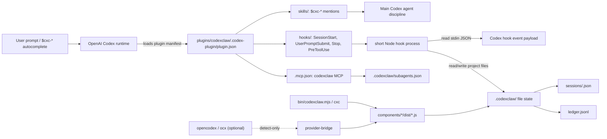

# Codexclaw Architecture Reference

> codexclaw 프로젝트의 구조 허브. Start here for the single-plugin shape, the Codex runtime boundary, component responsibilities, skills/hooks/CLI surfaces, and the `.codexclaw/` state model.
>
> Planning state lives under `devlog/_plan/`: `mvp_res/` is the shipped MVP source-of-record, while `mvp_hard/` is the parity-hardening track.

---

## 시스템 개요



codexclaw is a **single Codex plugin**, not a server. It reuses the OpenAI `codex` runtime and layers cli-jaw-style development discipline onto Codex through skill mentions, hooks, file state, subagent prompts, and the `cxc` CLI. There are no jaw employees, no boss token, no external orchestrator server, and no plugin-defined `/` slash commands; `/` commands live in the Codex runtime, while codexclaw's discovery surface is `$cxc-*` skills plus hook-triggered context injection.

opencodex (`ocx`) is adjacent but optional. opencodex is a local provider proxy that can inject `model_provider = "opencodex"` into Codex config and serve `/v1/responses`; codexclaw only detects `ocx` status through `provider-bridge` and never vendors or auto-ensures opencodex.

---

## 읽기 순서

| Tier | 문서 / code | 핵심 내용 |
|:----:|-------------|-----------|
| **1 — Foundation** | `README.md`, `plugins/codexclaw/.codex-plugin/plugin.json`, `devlog/_plan/mvp_res/000_INDEX.md` | single plugin boundary, manifest surfaces, shipped MVP ledger |
| **2 — Runtime Flow** | `plugins/codexclaw/hooks/*.json`, `plugins/codexclaw/components/pabcd-state/src/hook.ts`, `plugins/codexclaw/components/pabcd-state/src/goal-gate.ts`, `plugins/codexclaw/components/pabcd-state/src/cli.ts` | Codex hook events -> short Node process -> additionalContext or deny envelope |
| **3 — State + CLI** | `plugins/codexclaw/components/pabcd-state/src/state.ts`, `fsm.ts`, `bin/codexclaw.mjs`, `plugins/codexclaw/components/cxc-ops/src/*.ts` | `.codexclaw/` session files, phase legality, `cxc` command delegation |
| **4 — Capabilities** | `plugins/codexclaw/skills/`, `plugins/codexclaw/agents/`, `plugins/codexclaw/components/subagent-config/src/` | `$cxc-*` skill family, inline subagent roles, model/prompt config |
| **5 — Context** | `devlog/_plan/mvp_res/`, `devlog/_plan/mvp_hard/`, `../opencodex/README.md`, `../opencodex/src/codex-inject.ts` | shipped MVP vs hardening work, optional host/provider proxy relationship |

> Tier 1 -> 3 gives the live runtime shape. Tier 4 explains how users and subagents experience it. Tier 5 is for historical decisions and parity gaps.

---

## 문서 맵

| Area | Source of truth | 키워드 |
|------|-----------------|--------|
| Plugin manifest | `plugins/codexclaw/.codex-plugin/plugin.json` | skills, hooks, MCP, plugin metadata |
| CLI entry | `bin/codexclaw.mjs` | `cxc`, delegation, ops commands |
| Hooks | `plugins/codexclaw/hooks/*.json` | Codex hook event wiring |
| PABCD state | `plugins/codexclaw/components/pabcd-state/src/` | IPABCD FSM, state files, directives, goal gates |
| Feature activation | `plugins/codexclaw/components/config-guard/src/` | Codex feature flags, backup, revert manifest |
| Ops helpers | `plugins/codexclaw/components/cxc-ops/src/` | doctor, reset, chat-search |
| Provider bridge | `plugins/codexclaw/components/provider-bridge/src/` | ocx detect-only bridge |
| Subagent config | `plugins/codexclaw/components/subagent-config/src/` | role model/prompt config, MCP tools, catalog |
| Skills | `plugins/codexclaw/skills/` | `$cxc-*`, display_name autocomplete, dev routers |
| Subagent roles | `plugins/codexclaw/agents/` | explorer, reviewer, executor inline prompts |

---

## Component Map

### `components/config-guard`

Controlled activation for the Codex features codexclaw needs. `src/features.ts` declares `multi_agent`, `goals`, `hooks`, and soft `default_mode_request_user_input`; it parses `codex features list` output by exact feature name. `src/activate.ts` backs up `config.toml`, enables only missing declared flags through the official `codex features enable`, and writes `.codexclaw-install.json` under Codex home. `src/deactivate.ts` reverts only flags codexclaw enabled and refuses blind revert if the config hash drifted. `src/cli.ts` is the production binding that resolves `CODEX_HOME` / `~/.codex` and shells out to `codex`.

### `components/cxc-ops`

Local operations that do not require a codexclaw server. `src/doctor.ts` checks manifest parseability, hook file presence, skill metadata, agent TOMLs, MCP config drift, and optional ast-grep availability. `src/reset.ts` removes only scoped `.codexclaw/` working state: `--state`, `--generated`, or `--all`. `src/chat-search.ts` wraps the Codex app-server `thread/search` endpoint when available and returns clean `ok` / `no_results` / `unavailable` outcomes. `src/cli.ts` dispatches `doctor`, `reset`, and `chat-search`.

### `components/pabcd-state`

The IPABCD file-state engine and hook logic. `src/state.ts` owns `Phase = "IDLE" | "I" | "P" | "A" | "B" | "C" | "D"`, `.codexclaw/sessions/<sessionId>.json`, and `.codexclaw/ledger.jsonl`. `src/fsm.ts` defines `nextPhase()`, legal entry checks, attest-gated A->B and C->D flag flips, and D->IDLE cycle close. `src/hook.ts` detects explicit prompt triggers, injects phase directives or compact stage headers through `additionalContext`, and keeps Stop passive today. `src/goal-gate.ts` handles PreToolUse denials for budgeted `create_goal` calls and goal-mode `request_user_input`. `src/cli.ts` is the hook stdin/stdout process and `freeze` command entry.

Supporting files include `attest.ts` for evidence validation, `parse.ts` for hook payload parsing, `interview.ts` / `minds.ts` / `triage.ts` for interview readiness and contradiction support, `transcript.ts` for transcript-tail idempotency, and `freeze.ts` / `freeze-cli.ts` for freeze manifest handling.

### `components/provider-bridge`

opencodex detection, not opencodex management. `src/detect.ts` resolves whether `ocx` is on PATH and parses read-only `ocx status --json` into `provider`, `native`, or `error` status. `src/cli.ts` is the SessionStart hook / manual detect entry. It explicitly does not run `ocx ensure`, `ocx sync`, mutate Codex config, or fail the Codex session when ocx is absent.

### `components/subagent-config`

Per-role subagent model and prompt configuration. `src/store.ts` reads/writes `.codexclaw/subagents.json` atomically for `explorer`, `reviewer`, and `executor`, defaulting each role to the main Codex model. `src/catalog.ts` builds a selectable model catalog from the native Codex cache allowlist plus optional ocx-backed model ids, with native models first. `src/mcp.ts` serves a stdio MCP server with `subagents_get`, `subagents_set`, and `catalog_list` tools.

---

## Skills Map

codexclaw skills live under `plugins/codexclaw/skills/`. Their `agents/openai.yaml` `interface.display_name` values are the user-facing `$` autocomplete names; folder names are implementation paths. Only `cxc-dev` is implicit-visible by policy, while the rest are on-demand and explicitly invokable.

| Skill display name | Folder | Role |
|--------------------|--------|------|
| `cxc-dev` | `skills/dev/` | always-on development discipline: classifier, modularity, verification, safety |
| `cxc-pabcd` | `skills/pabcd/` | Codex-native IPABCD workflow discipline |
| `cxc-dev-architecture` | `skills/dev-architecture/` | module boundaries, circular deps, coupling, validation placement |
| `cxc-dev-backend` | `skills/dev-backend/` | API/server/database/backend operations guidance |
| `cxc-dev-data` | `skills/dev-data/` | pipelines, ETL/ELT, SQL, schema/data quality |
| `cxc-dev-debugging` | `skills/dev-debugging/` | root-cause debugging method |
| `cxc-dev-frontend` | `skills/dev-frontend/` | UI/frontend implementation |
| `cxc-dev-uiux-design` | `skills/dev-uiux-design/` | design judgment, UX states, logos/typography |
| `cxc-dev-testing` | `skills/dev-testing/` | test strategy, QA, CI gates |
| `cxc-dev-code-reviewer` | `skills/dev-code-reviewer/` | review verdicts, findings, risk assessment |
| `cxc-dev-security` | `skills/dev-security/` | auth, secrets, validation, supply-chain/security review |
| `cxc-dev-devops` | `skills/dev-devops/` | containers, deploy, IaC, SRE/release surfaces |
| `cxc-dev-scaffolding` | `skills/dev-scaffolding/` | project/module scaffolding and structure audits |
| `cxc-search` | `skills/search/` | current/public lookup ladder and Korean search intent guard |
| `cxc-skill-hub` | `skills/skill-hub/` | on-demand skill catalog router |
| `cxc-ast-grep` | `skills/ast-grep/` | AST-aware search/codemods using `sg` |

The `dev` hub routes by change surface toward hidden `dev-*` skills. `skill-hub` documents the exposure model: `allow_implicit_invocation` controls auto-rendered skill visibility, while explicit `$skill` / path mention still works unless a skill is disabled.

---

## Hooks

The manifest wires five hook JSON files:

| Hook event | Hook file | Command | Live behavior |
|------------|-----------|---------|---------------|
| `SessionStart` | `hooks/session-start-ensuring-provider-bridge.json` | `node "${PLUGIN_ROOT}/components/provider-bridge/dist/cli.js" hook session-start` | emits one ocx status JSON line; detect-only |
| `UserPromptSubmit` | `hooks/user-prompt-submit-checking-pabcd-trigger.json` | `node "${PLUGIN_ROOT}/components/pabcd-state/dist/cli.js" hook user-prompt-submit` | detects explicit IPABCD triggers and injects phase context |
| `Stop` | `hooks/stop-checking-pabcd-continuation.json` | `node "${PLUGIN_ROOT}/components/pabcd-state/dist/cli.js" hook stop` | currently passive no-op; continuation loop is hardening-track work |
| `PreToolUse` `^create_goal$` | `hooks/pre-tool-use-guarding-goal-budget.json` | `node "${PLUGIN_ROOT}/components/pabcd-state/dist/cli.js" hook pre-tool-use` | denies `create_goal` inputs with keys other than `objective` |
| `PreToolUse` `^request_user_input$` | `hooks/pre-tool-use-guarding-interview-in-goal.json` | same pabcd-state CLI | denies user-input/interview tool use while native goal mode is active or unreadable |

Hook processes are intentionally short: read stdin JSON, reconstruct state, optionally write `.codexclaw/`, then print either nothing or one JSON hook envelope. `UserPromptSubmit` outputs `hookSpecificOutput.additionalContext`; `PreToolUse` can output `permissionDecision: "deny"` with a reason. Non-PreToolUse errors fail open to avoid blocking Codex; the goal-mode `request_user_input` guard is fail-closed.

---

## CLI Surface

`package.json` exposes both `codexclaw` and `cxc`, with `cxc` as the preferred short alias. `bin/codexclaw.mjs` is a small delegator:

| Command | Delegates to | Notes |
|---------|--------------|-------|
| `cxc enable` | `components/config-guard/dist/cli.js enable` | activates declared Codex feature flags |
| `cxc uninstall` / `cxc disable` | `components/config-guard/dist/cli.js disable` | reverts only flags codexclaw enabled when safe |
| `cxc status` | `components/config-guard/dist/cli.js status` | prints declared feature enabled/disabled state |
| `cxc doctor` | `components/cxc-ops/dist/cli.js doctor` | plugin health report |
| `cxc reset` | `components/cxc-ops/dist/cli.js reset` | scoped `.codexclaw/` cleanup |
| `cxc chat-search` | `components/cxc-ops/dist/cli.js chat-search` | Codex app-server thread search wrapper |
| `cxc gui` | `plugins/codexclaw/gui` via `npm run dev` | starts the Vite dashboard when deps exist |
| `cxc subagents` | current CLI stub | Phase 2 surface placeholder in the root delegator |
| `cxc provider` | current CLI stub | Phase 2 provider bridge placeholder in the root delegator |

There is no `cxc orchestrate` in the current root CLI; `mvp_hard/` tracks the future parity-hardening work for chat/CLI phase control.

---

## State Model

Runtime project state is file-based and rooted at the working directory:

```text
.codexclaw/
  sessions/
    <sessionId>.json
  ledger.jsonl
  subagents.json
```

`sessions/<id>.json` follows the `State` shape from `components/pabcd-state/src/state.ts`: `phase`, `sessionId`, `slug`, `updatedAt`, `flags`, `supersededBy`, `injectedTurns`, `lastInjectedPhase`, `orchestrationActive`, and `interview`. Reads are strict reconstruction: unknown fields are dropped, invalid phase values fall back to default state, and the interview flag is derived from the normalized interview tracker.

The phase enum is `IDLE/I/P/A/B/C/D`. `IDLE` is the closed/rest state. `I` through `D` are work phases. `D` is a transition phase that closes the current work-phase back to `IDLE`; it is not the resting state. In `fsm.ts`, `nextPhase(D)` returns `IDLE`, while `nextPhase(IDLE)` returns `null` because callers choose the next entry explicitly.

`ledger.jsonl` is the append-only audit-trail target exposed by `appendLedger()`. The current Stop hook does not auto-advance or spam the ledger; transition-ledger wiring is tracked in `mvp_hard/`.

`subagents.json` is owned separately by `components/subagent-config/src/store.ts` and stores role-level model/prompt selection. It is not part of the PABCD phase session JSON.

---

## Subagents

Subagent role TOMLs live under `plugins/codexclaw/agents/`: `explorer`, `reviewer`, and `executor`. They are canonical prompt sources, not auto-registered plugin roles. Codex plugin manifests expose `skills`, `hooks`, `mcpServers`, and apps; codexclaw therefore uses inline prompt injection when spawning Codex-native `explorer` or `worker` agents.

| Role | Codex `agent_type` | Writes | Purpose |
|------|--------------------|--------|---------|
| `explorer` | `explorer` | no | read-only codebase investigation with file evidence |
| `reviewer` | `explorer` | no | adversarial plan/diff review with PASS/FAIL blockers |
| `executor` | `worker` | scoped yes | bounded implementation inside an assigned write scope |

The subagent config component can later select per-role models; default mode inherits the main Codex model.

---

## Planning Tracks

`devlog/_plan/mvp_res/` is the canonical shipped MVP ledger. It records L1-L28 as DONE, including state engine, directive hook, goal gate, dev router skills, subagent roles, install activation, provider bridge, subagent config, model catalog, and GUI subagent page. L29-L31 are deferred/planned future work.

`devlog/_plan/mvp_hard/` is the parity-hardening lane after the MVP. It documents the gap between codexclaw's current `$cxc-*` + hook UX and cli-jaw/jawcode-style explicit PABCD phase control. Its locked constraints are important: no codex-rs fork, no plugin slash commands, no external orchestrator, file-based state only.

---

## Boundary Rules

- codexclaw is loaded by Codex; it does not replace Codex.
- codexclaw hooks append context or deny tool calls; they do not swallow/replace user prompts.
- codexclaw state is project-local `.codexclaw/`, not a jaw server database.
- `ocx` is optional provider infrastructure; codexclaw's provider bridge is detect-only.
- `$cxc-*` names are skill mentions/autocomplete; they are not slash commands.
- `cxc` is a local CLI alias for plugin ops, not a server API.

---

*Last updated: 2026-06-30. Grounded in `README.md`, `plugins/codexclaw/.codex-plugin/plugin.json`, `plugins/codexclaw/hooks/*.json`, component `src/` files, skill metadata, subagent TOMLs, `devlog/_plan/mvp_res/000_INDEX.md`, `devlog/_plan/mvp_hard/000_INDEX.md`, and opencodex README/source files.*
